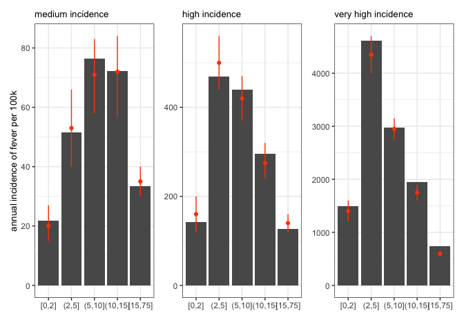
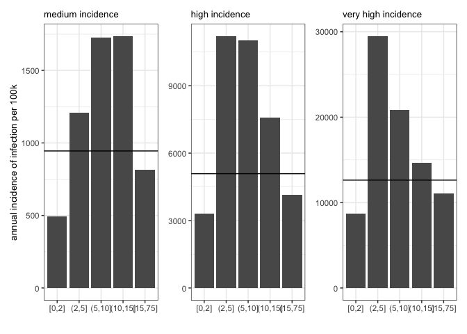
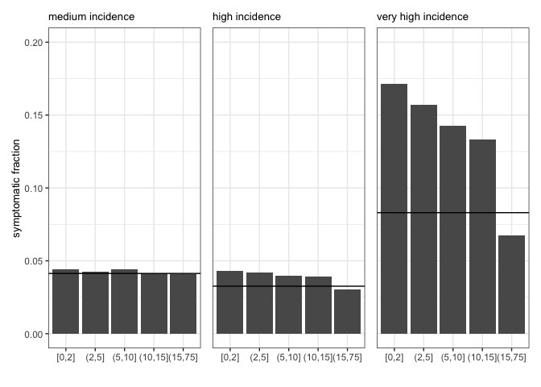
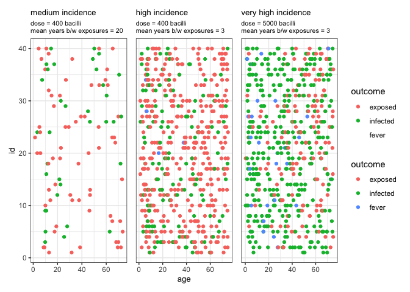
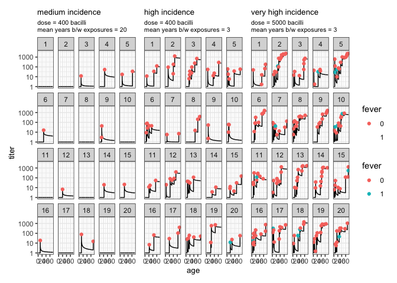
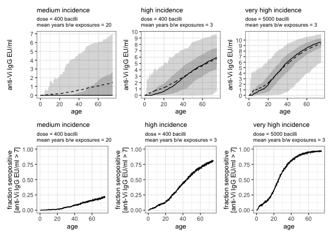
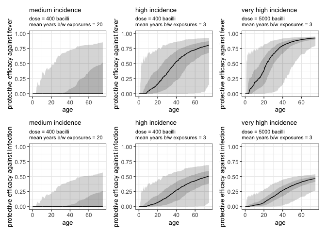

# A view over the horizon: cohort incidence model

After spending a lot of time with the primary literature on typhoid
vaccine efficacy, correlates of protection, natural immunity, dose
response from human challenge studies, seroepidemiology studies, and a
lot of thinking, my manager Edward Wenger *encouraged* me to just do the
thing. This script is the central artifact of that push.

**What?** Implement the new intrahost immunity model in the context of a
constant force-of-infection cohort model. Show that I can reproduce
medium, high, and very high incidence archetypes being considered by a
WHO-organized modeling consortium exercise. Other than the waning model,
which was calibrated to organized and specific data with a simple
log-least-squares approach all default parameters are currently
hand-tuned by me, triangulating across various observations I’ll try to
summarize below.

**What did I learn?** It works! The model can accomodate a bunch of
non-trivial observations across a diversity of sources and settings.
And, having the model prototype with a bunch of outputs has enabled a
lot of rich back and forth with Kyra Grantz that’s already making this
model better and asking important questions of this new model, their
current model, and other sources of data and inferences about how
typhoid works.

**What’s next?** Put the model into Typhoidsim. Get serious about
calibration and applying it to vaccine policy questions. Iterate on many
science questions and additional model features around shedding.

<!-- more -->

## Outline

In this script, I’ll set up the immunity model and then embed it in a
cohort model. I’ll quickly document decisions and questions along the
way, leaving breadcrumbs for better documentation and future iterations
later on. After the setup, we’ll take it for a spin and see a bunch of
things it can do! Along the way, I’ll leave notes about the contrasts
with established models and problems or open questions with this one.
Enjoy!

## The code

First, let’s get some boilerplate out of the way and set up our
environment.

    # imports
    library(tidyverse)
    library(patchwork)
    library(ggridges)
    library(scales)

    # age width function
    # I use this later to re-extract age_group widths from a cut() call
    age_width = function(age_group,age_max){
      round(as.numeric(as.character(fct_recode( age_group,
                                                `2`='[0,2]',`3`='(2,5]',`5`='(5,10]',`5.1`='(10,15]',!!as.character(age_max-15):=paste('(15,',age_max,']',sep='')))))
    }

## Intrahost immunity model functions

The immunity model uses anti-Vi IgG ELISA titers as a correlate of
protection from infection and from fever, through the effect of immunity
on susceptibility as a function of bacterial dose. It is based on the
data described
[here](/docs/Literature%20Review/typhoid-vaccine-efficacy) and other
references not yet documented (especially human challenge studies with
data on shedding and disease).

The **titer response function** describes the time dynamics of the
correlate of protection (CoP). In this prototype, we assume no
individual-level variation—everyone has identical responses to identical
exposures and initial conditions. The titer response rises over 30.4
days (conveniently a month for simulation purposes, but ~28 days to peak
is probably ever so slightly more realistic.)

By assumption, the initial unexposed baseline value of the correlate of
protection is set to 1. The most common assay (VaccZyme Anti-Vi IgG) has
a limit of detection (LOD) of 7 EU/ml, so I don’t know the baseline for
sure. But modeling the censoring seems to say 1 works pretty well and
also I don’t think it matters because of how the fold-rise model (to
come) works. (Any lower number will get multiplied by a higher number
above LOD and end up back in the observable range.) The peak CoP default
is set to 1000 until otherwise specified by the fold-rise model. The
long-time power-law exponent *α*, the reference short-time decay
constant *T**d**e**c**a**y*, and the age-dependency
coefficients on them are fit to titer data, to be explained another day.
The initial rise parameters are all just picked to be about right/pretty
because they have no effect on the rest of the model.

    # titer response function
    titer_vs_time = function(t,age_years, CoP_peak=1000, CoP_pre=1,
                             T_decay=11, alpha=1.16,
                             beta_T_decay_age=0.057, beta_alpha_age=-0.060,
                             CoP_min=1,T_rise=1.5,t_start=3,t_peak=30.4){
      
      Tda = T_decay * exp(beta_T_decay_age * age_years)
      ka = alpha * exp(beta_alpha_age * age_years)
      
      # power law decay
      titer = CoP_min + (CoP_peak-CoP_min)*(1+(t-t_peak)/(ka*Tda))^(-ka)
      
      # simple logistic interpolator rise (this is just for continuity/realism. plays no role in the model)
      titer[t<t_peak ] =
        CoP_pre + (CoP_peak-CoP_pre)*
        (1/(1+exp(-(t[t<t_peak] - t_start*5)/T_rise)) - 1/(1+exp(-(0-t_start*5)/T_rise)))/
        (1/(1+exp(-(t_peak - t_start*5)/T_rise)) - 1/(1+exp(-(0-t_start*5)/T_rise)))
      
      return(titer)
    }

    expand.grid(t=seq(0,10,by=1/24), age_years = factor(c(1,5,15,45))) |> 
      mutate(titer = titer_vs_time(t=t*365,age=as.numeric(age_years))) |>
      ggplot() +
      geom_line(aes(x=t,y=titer,color=age_years)) + 
      theme_bw() + scale_y_continuous(trans='log10') + xlab('years post response') + ylab('')

The **fold-rise model** describes the CoP response after an immunizing
event, given the pre-challenge CoP. The default for
*C**o**P**m**a**x*, the maximum possible titer (discussed
[here](https://famulare.github.io/2024/03/07/Conjecture-the-maximum-NAb-titer.html))
comes from an analysis of pre-post vaccine responses, and the default
*m**u*0 parameter is set by a loosely informed guess from [a
model of pre-post infection
dynamics](https://www.thelancet.com/journals/lanmic/article/PIIS2666-5247(22)00114-8/fulltext#fig3)
and triangulating some vaccine study control groups, all to be explained
another day.

    # fold-rise model. defaults set to natural immunity defaults
    fold_rise_model = function(CoP_pre,
                               mu_0=1.25,
                               CoP_max=10^3.5, CoP_min=1,
                               sigma_0=0.5, # made up value for now, informed by polio (2.9/7.2)*mu_0
                               response='individual'){# 'median'
      if(response == 'median'){
        mu = mu_0
      } else if (response=='individual'){
        mu = pmax(0,rnorm(length(CoP_pre),mean=mu_0,sd=sigma_0))
      }
      fold_rise = 10^(mu*(1-(log10(CoP_pre)-log10(CoP_min))/(log10(CoP_max)-log10(CoP_min))))
      return(fold_rise)
    }

    pl_df=expand.grid(CoP_pre=10^seq(0,3.5,by=0.1)) |> 
      mutate(fold_rise = fold_rise_model(CoP_pre=CoP_pre, response='median')) |>
      mutate(CoP_post = fold_rise * CoP_pre) 
    (ggplot(pl_df) +
      geom_line(aes(x=CoP_pre,y=fold_rise)) +
      theme_bw() + scale_y_continuous(trans='log10') + scale_x_continuous(trans='log10') +
      xlab('pre-challenge titer') + ylab('fold-rise')) +
      (ggplot(pl_df) +
         geom_line(aes(x=CoP_pre,y=CoP_post)) +
         theme_bw() + scale_y_continuous(trans='log10') + scale_x_continuous(trans='log10') +
         xlab('pre-challenge titer') + ylab('post-challenge titer'))

The fold-rise model combines with the titer vs. time model to give the
immune response over a lifetime of infection (in this case, or
vaccination too but not shown here). As an example, here’s an unlucky
person infected on their 2nd birthday and again on their 7th.

    data.frame(t=seq(0,15,by=1/12), titer=1) |> 
      mutate(titer = if_else(t<=2, titer, 
                             titer_vs_time(t=(t-2)*365,age=2,
                                           CoP_pre=titer[t==2],
                                           CoP_peak = titer[t==2]*fold_rise_model(CoP_pre = titer[t==2])))) |>
      mutate(titer = if_else(t<=7, titer, 
                             titer_vs_time(t=(t-7)*365,age=7,
                                           CoP_pre=titer[t==7],
                                           CoP_peak = titer[t==7]*fold_rise_model(CoP_pre = titer[t==7])))) |>
      ggplot() +
      geom_line(aes(x=t,y=titer)) + 
      theme_bw() + scale_y_continuous(trans='log10') + xlab('age [years]') + ylab('Anti-Vi IgG [EU/ml]')

We care about titers because we use them as a correlate of protection.
The evidence on typhoid supports that anti-Vi titers are a useful
predictor, and we can encode the affect of prior immunity through that
the the effect of dose, where it’s known from challenge studies that
higher doses are more likely to lead to stool-culture confirmed
infection and fever.

The **dose-response model** as a function of immunity and bacilli eaten
is given below. It’s informed by old challenge studies that measured it
directly in cohorts without well-measured prior immunity, and more
recent studies with naive adults. Parameters are hand-fiddled based on
that an a bunch of other things included vaccines, all to be described
another day.

    # dose response
    p_outcome_given_dose = function(dose=1e4,  CoP_pre=1, outcome = 'fever_given_dose', 
                                    n50_fever_given_dose=27800, alpha_fever_given_dose=0.84, 
                                    gamma_fever_given_dose=0.4,
                                    n50_infection_given_dose=27800/40,alpha_infection_given_dose = 0.84*2, 
                                    gamma_infection_given_dose=0.4/2 
                                    ){
      
      if(outcome == 'fever_given_dose'){
        
        p = 1 - (1+dose*(2^(1/alpha_fever_given_dose)-1)/n50_fever_given_dose)^(-alpha_fever_given_dose/(CoP_pre^gamma_fever_given_dose))
        
      } else if (outcome == 'infection_given_dose'){
        
        p = 1 - (1+dose*(2^(1/alpha_infection_given_dose)-1)/n50_infection_given_dose)^
          (-alpha_infection_given_dose/(CoP_pre^gamma_infection_given_dose))
        
      } else if (outcome == 'fever_given_infection'){
        
        p = (1 - (1+dose*(2^(1/alpha_fever_given_dose)-1)/n50_fever_given_dose)^
               (-alpha_fever_given_dose/(CoP_pre^gamma_fever_given_dose))) /
          (1 - (1+dose*(2^(1/alpha_infection_given_dose)-1)/n50_infection_given_dose)^
             (-alpha_infection_given_dose/(CoP_pre^gamma_infection_given_dose)))
        
      }
      
      return(p)
    }

    expand.grid(dose = 10^seq(0,9,by=0.1),
                CoP_pre = round(10^seq(0,3.5,by=0.5)),
                outcome=factor(c('infection_given_dose','fever_given_dose'),
                               levels=c('infection_given_dose','fever_given_dose','fever_given_infection'))) |>
      group_by(outcome,CoP_pre,dose) |>
      mutate(probability = p_outcome_given_dose(dose=dose,CoP_pre=CoP_pre,outcome = outcome)) |>
      mutate(CoP_pre = factor(CoP_pre)) |>
      ggplot() +
      geom_line(aes(x=dose,y=probability,group=CoP_pre,color=CoP_pre)) +
      facet_grid('~outcome') +
      theme_bw() +
      ylim(c(0,1)) +
      scale_x_continuous(trans='log10', breaks=10^seq(0,10,by=2),minor_breaks = NULL,
                         labels = trans_format("log10", math_format(10^.x)) ) 

The **protective efficacy of prior infection** (in this case, also
vaccine efficacy more generally) is defined as the relative risk
reduction in the outcome (either stool-culture confirmed infection or
fever, but could be other things like seroresponse, bacteremia, and
conversion to carrier status) for a person with a given level of
immunity vs a person who has never been exposed.

    # protective efficacy vs CoP_pre
    protective_efficacy = function(dose=1e4,  CoP_pre=1, outcome = 'fever_given_dose', CoP_control=1){
      VE = 1 - p_outcome_given_dose(dose,CoP_pre=CoP_pre,outcome = outcome)/
        p_outcome_given_dose(dose,CoP_pre=CoP_control,outcome = outcome)
      return(VE)
    }

    expand.grid(dose = 10^seq(0,8,by=0.1),
                CoP_pre = round(10^seq(0,3.5,by=0.5)),
                outcome=factor(c('infection_given_dose','fever_given_dose'),
                               levels=c('infection_given_dose','fever_given_dose','fever_given_infection'))) |>
      group_by(outcome,CoP_pre,dose) |>
      mutate(protective_efficacy = protective_efficacy(dose=dose,CoP_pre=CoP_pre,outcome = outcome)) |>
      mutate(CoP_pre = factor(CoP_pre)) |>
      ggplot() +
      geom_line(aes(x=dose,y=protective_efficacy,group=CoP_pre,color=CoP_pre)) +
      facet_grid('~outcome') +
      theme_bw() +
      ylim(c(0,1)) +
      scale_x_continuous(trans='log10', breaks=10^seq(0,10,by=2),minor_breaks = NULL,
                         labels = scales::trans_format("log10", math_format(10^.x)) ) 

The really interesting thing about this kind of model is that it
captures how high doses can overwhelm prior immunity and reduce
efficacy. This effect is critical for typhoid epidemiology, where
exposures can vary by a factor of 1000 or more across settings in time
and place, but is missing from the standard logistic regression
approaches to modeling efficacy vs CoP that are standard in vaccinology
(and which this model reduces to in the low dose limit.)

## Cohort incidence model

To show what the model can do, I built a constant force of infection
cohort model. This model is designed to demonstrate what individual
susceptibility and immune response looks like over a lifetime, in
fictional settings where the force of infection never changes. It isn’t
a full transmission model because this version of the model lacks
bacterial shedding, transmission routes, and contacts between people.
But, any transmission model that establishes these endemic equilibrium
exposure rates would show the same cohort behavior for these variables.

To make everything play nice for running the model and plotting later, I
wrapped the whole thing in a function. So let’s have some fun stepping
through that function, in the literate programming style enabled by
`knitr::spin` and a [custom post-processing
one-liner](https://github.com/famulare/typhoid-immune-dynamics/blob/277c1ce3606a88c2374be892c7d1f7c5788d0ec7/docs/docs_helper_functions.R#L70).

First, we define the function and it’s inputs.

    cohort_model = function(exposure_dose,exposure_rate,
                            N=1000,age_max=75,
                            titer_dt=365/12, # monthly timesteps so I can assume infections last one timestep
                            max_titer_id = 1000 # saving every titer above ~1000 gets really slow
                            ){
The two variables that define the transmission ecology are the exposure dose and exposure rate. The exposure dose is the number of bacilli typically ingested when exposed in the setting. This could be drawn from a distribution, but we'll just assume it's a fixed value for now. The exposure rate is the Poisson rate for how often a person is exposed to an infectious dose. Together, through the dose response model, the exposure rate and dose determine how often people get infected. 

The other parameters are just basic simulation config stuff. How many people (default `N=1000`), what is the maximimum age in years (default `age_max = 75`), the timestep (default `titer_dt=365/12`= 1 month), and how many people will we track the full time history of the titer for (default 'max_titer_id=1000'; I suggest you keep this at this size regardless of the N, as this is the slowest part of the code), 

With the function header and parameters defined, we step into the code. First, we initialize the time bins and the containers for the simulation outputs. 

      simulation_months = seq(0,age_max*12-1,by=1)
      
      # titer tracker
      titer_df = expand.grid(id=1:max_titer_id, 
                             month=simulation_months,
                             titer=1) |>
        mutate(age_years=month/12,
               age_group=cut(age_years,breaks=c(0,2,5,10,15,age_max),include.lowest = TRUE)) |>
        mutate(age_width = age_width(age_group,age_max))
      
      # disease events tracker
      events_list =  replicate(N, list(exposure_month = NULL, exposure_count=NULL,
                                       infected = NULL, 
                                       fever = NULL), 
                               simplify = FALSE)

We also make one extra accounting for reality, which is that young children have less exposure to typhoid. Infants because they do not eat adult food, and toddlers because they tyically eat small and limited diets. This should probably be configurable as parameters, but I'm not gonna play with it in this script so I just hard coded that children up through 12 months of age have 10% the exposure of adults and children 1-2 years have 50%, by pure assumption.

      # age-dependent exposure rate, to account for kids under 2y having less exposure to food and sewage
      exposure_rate_multiplier = c(rep(0.1,13),rep(0.5,12),rep(1,length(simulation_months)-25))

With that set up, we can expose everyone for their lifetimes and save the exposure event times.

      # expose
      for (id in (1:N)){
        tmp_exposed = rpois(length(exposure_rate_multiplier),exposure_rate*exposure_rate_multiplier)
        events_list[[id]]$exposure_month = which(tmp_exposed>0)
        events_list[[id]]$exposure_count = tmp_exposed[events_list[[id]]$exposure_month]
        
        # declare needed fields
        events_list[[id]]$infected = rep(0, length(events_list[[id]]$exposure_month))
        events_list[[id]]$fever = rep(0, length(events_list[[id]]$exposure_month))
      }

Now that we know when everone is exposed, we can step through to find when they are infected, and after each infection, what their antibody titers are until the next infection. At each exposure, the probability of infection is determined by the dose and the current titer. At each infection, the current titer is boosted by the fold-rise model and between infections, it wanes with the waning model. 

      # infect and titer
      for (id in (1:N)){
        
        # titer holder, initialized at CoP_min=1 from birth
        tmp_titer =rep(1,length(simulation_months))
        
        # for each exposed person
        if (length(events_list[[id]]$exposure_month) >0){
          for (k in 1:length(events_list[[id]]$exposure_month)){
            
            exposure_month = events_list[[id]]$exposure_month[k]
            
            # calculate their infection probability in that timestep (which may have more than 1 exposure)
            p_once = p_outcome_given_dose(dose=exposure_dose,CoP_pre=tmp_titer[exposure_month],
                                          outcome='infection_given_dose')
            p_inf = 1-(1-p_once)^events_list[[id]]$exposure_count[k]
            
            if(runif(1)>p_inf){
              # if not infected, record not infected upon exposure
              events_list[[id]]$infected[k] = 0
              events_list[[id]]$fever[k]    = 0
            } else {
              # if infected 
              
              # update infection list
              events_list[[id]]$infected[k]=1
              
              # calculate probability they get a fever given infection
              p_fever = p_outcome_given_dose(dose=exposure_dose,CoP_pre=tmp_titer[exposure_month],
                                             outcome='fever_given_infection')
              
              # update fever list
              if (runif(n=1)<=p_fever){
                # if fever
                events_list[[id]]$fever[k]=1
              } else {
                # if no fever
                events_list[[id]]$fever[k]=0
              }
              
              # construct piecewise titer curve from current infection forward
                titer_pre = tmp_titer[exposure_month]
                titer_post = titer_pre * fold_rise_model(CoP_pre = titer_pre)
                
                future_times = exposure_month:length(simulation_months)
                future_times_from_new_infection = titer_dt*(simulation_months-exposure_month+1)[future_times]
                
                # call titer function
                tmp_titer[future_times] = titer_vs_time(t=future_times_from_new_infection,
                                                        age_years = exposure_month/12,
                                                        CoP_pre = titer_pre,
                                                        CoP_peak= titer_post)
                
              # round just because I don't need a bazillion digits
              tmp_titer[exposure_month:length(tmp_titer)] = round(tmp_titer[exposure_month:length(tmp_titer)],2)
            }
            
          }
          
          # only save titer traces if the subject id is <= max_titer_id, because this is expensive.
          if(id <= max_titer_id){
            idx = titer_df$id == id
            titer_df$titer[idx] = tmp_titer
          }
        }
      }
      
That takes us through the whole model! But events_list was kind of an ugly way to do things, when we couldn't *a priori* know how many exposure events would happen for each person. So let's tidy that up now into a nice dataframe and add infection events to the titer traces for plotting later. And return the outputs.

      # make the events_list into a nice data frame
      
        # select all list elements (people) with at least one infection event
        not_empty_idx = which(!sapply(events_list, function(x){ is_empty(x$exposure_month)}))
        
        # challenge to the reader (and author): how does this work???
        events_df = tibble(id = not_empty_idx, data = events_list[not_empty_idx]) |>
          unnest_wider(data) |>
          unnest_longer(c(exposure_month,exposure_count,infected,fever), keep_empty = TRUE) |>
          mutate(exposure_age=exposure_month/12,
                 age_group=cut(exposure_age,breaks=c(0,2,5,10,15,age_max),include.lowest = TRUE)) |>
          mutate(age_width=age_width(age_group,age_max)) |>
          group_by(id) |>
          mutate(infection_age = if_else(infected==1,exposure_age,NA)) |>
          mutate(fever_age = if_else(fever==1,exposure_age,NA)) |>
          mutate(infected = factor(infected),
                 fever = factor(fever)) |>
          mutate(outcome = interaction(infected,fever)) |>
          mutate(outcome = fct_recode(outcome,exposed='0.0',infected='1.0',fever='1.1')) |>
          mutate(outcome = factor(outcome,levels=c('exposed', 'infected', 'fever')))

      # combine time of infection events with titers for plotting
      titer_df = titer_df |>
        left_join(events_df |> select(id,infection_age,infected,fever) |> 
                    drop_na(infected),by=join_by(id ==id, age_years == infection_age))

      # return
      return(list(titer_df=titer_df,
                  events_df=events_df,
                  config=data.frame(exposure_dose,exposure_rate,N,age_max,titer_dt)))
      
    }

## Running the model

Now that we have a model, let’s take it for a spin. With an eye towards
supporting [WHO SAGE in typhoid vaccine
policy](https://www.who.int/groups/strategic-advisory-group-of-experts-on-immunization/working-groups/typhoid)
decisions ([archival
link](https://web.archive.org/web/20250616214834/https://www.who.int/groups/strategic-advisory-group-of-experts-on-immunization/working-groups/typhoid)),
we hand-picked exposure rate and dose parameters to roughly mimic three
composite archetypes for typhoid incidence. The “medium” incidence
setting is characterized by an all-ages annual incidence of typhoid
fever less than 100 per 100k persons per year and a flat age
distribution among after infancy. The “high” and “very high” incidence
settings have similar age distributions that peak at young ages, but
differ in overall incidence (100/100k &lt; “high” &lt; 1000/100k
vs. $1000/100k &lt; “very high”).

    # if the simulation output is saved, just use the cache. Otherwise, run the models.
    if (TRUE | !file.exists('scratch/output_cache.RData')){
      output=list()
      
      # define setting ecology: exposure rate and dose

        N_cohort=2e4 # a lot faster for playing
        # N_cohort=1e6 # made huge to get good stats at lower incidence
      
        # medium
        output[['medium']] = cohort_model(exposure_dose = 3e2,
                                          exposure_rate=1/(12*20), # per month
                                          N=N_cohort)
        
        # high
        output[['high']] = cohort_model(exposure_dose = 5e2,
                                        exposure_rate=1/(12*5), # per month
                                        N=N_cohort/5)
        
        # very high
        output[['very_high']] = cohort_model(exposure_dose = 5e3,
                                             exposure_rate=1/(12*2), # per month
                                             N=N_cohort/10)
        
        save(output,N,file='scratch/output_cache.RData')
    } else {
      load(file='scratch/output_cache.RData')  
    }

And, for summarizing the results, let’s calculate incidence per 100k
people by age and overall from the events data, and include the total
incidence archetype targets for reference.

    # incidence targets
    incidence_fever_targets = c(medium = 53,high=214,very_high=1255)

    # calculate incidence
    for (k in 1:length(output)){
      
      N = output[[k]]$config$N
      
      output[[k]]$incidence_vs_age =
        output[[k]]$events_df |> group_by(age_group) |>
        summarize(incidence_fever = sum(fever==1)/(N*unique(age_width))*1e5,
                  incidence_infection = sum(infected==1)/(N*unique(age_width))*1e5,
                  symptomatic_fraction = sum(fever==1,na.rm=TRUE)/sum(infected==1,na.rm=TRUE),
                  age_width = unique(age_width)) |>
        mutate(incidence_fever_overall = sum(incidence_fever*age_width/sum(age_width)),
               incidence_infection_overall = sum(incidence_infection*age_width/sum(age_width)),
               symptomatic_fraction_overall = sum(symptomatic_fraction*age_width/sum(age_width)),
               incidence_fever_target = incidence_fever_targets[names(output)[k]])
    }

## Results!

### Incidence by age and across setting archetypes

Now we make lots of plots. This first loop makes panels for each
transmission setting and type of incidence we’re currently interested in
– fever, any infection (as determined by stool shedding), and the
fraction of infections with fever. There’s a bunch of ggplot stuff and
I’m sure I could make it less verbose but that’s not the point–this is
model diagnostics in action.

    p_incidence_fever=list()
    p_incidence_infection=list()
    p_symptomatic_fraction=list()
    for (k in 1:length(output)){
      p_incidence_fever[[k]]=ggplot(output[[k]]$incidence_vs_age) +
        geom_bar(aes(x=age_group,y=incidence_fever),stat='identity') +
        geom_hline(aes(yintercept=incidence_fever_overall[1]),linetype='solid') +
        geom_hline(aes(yintercept=incidence_fever_target[1]),linetype='dashed') +
        theme_bw() +
        xlab('') +
        ylab('annual incidence of fever per 100k') +
        labs(title = paste(sub('_',' ',names(output)[k]),' incidence',sep=''),
             subtitle=paste('dose = ',output[[k]]$config$exposure_dose,' bacilli\nmean years b/w exposures = ',
                            1/(12*output[[k]]$config$exposure_rate),sep='')) +
        theme(plot.title=element_text(size=10),plot.subtitle=element_text(size=8),
              axis.title = element_text(size=10))
      
      p_incidence_infection[[k]]=ggplot(output[[k]]$incidence_vs_age) +
        geom_bar(aes(x=age_group,y=incidence_infection),stat='identity') +
        geom_hline(aes(yintercept=incidence_infection_overall[1]),linetype='solid') +
        theme_bw() +
        xlab('') +
        ylab('annual incidence of infection per 100k') +
        labs(title = paste(sub('_',' ',names(output)[k]),' incidence',sep=''),
             subtitle=paste('dose = ',output[[k]]$config$exposure_dose,' bacilli\nmean years b/w exposures = ',
                            1/(12*output[[k]]$config$exposure_rate),sep='')) +
        theme(plot.title=element_text(size=10),plot.subtitle=element_text(size=8),
              axis.title = element_text(size=10))
      
      p_symptomatic_fraction[[k]]=ggplot(output[[k]]$incidence_vs_age) +
        geom_bar(aes(x=age_group,y=symptomatic_fraction),stat='identity') +
        geom_hline(aes(yintercept=symptomatic_fraction_overall[1]),linetype='solid') +
        theme_bw() +
        xlab('') +
        ylab('symptomatic fraction') +
        # ylim(c(0,1)) +
        labs(title = paste(sub('_',' ',names(output)[k]),' incidence',sep=''),
             subtitle=paste('dose = ',output[[k]]$config$exposure_dose,' bacilli\nmean years b/w exposures = ',
                            1/(12*output[[k]]$config$exposure_rate),sep='')) +
        theme(plot.title=element_text(size=10),plot.subtitle=element_text(size=8),
              axis.title = element_text(size=10))
    }

First up, typhoid fever incidence.

    wrap_plots(p_incidence_fever) + plot_layout(guides = "collect",axes='collect')

To roughly match the setting targets, we find that the medium incidence
setting corresponds to a characteristic typhoid dose of roughly 500
bacilli received once every 40 years on average. High and very high
incidence correspond roughly to an exposure every 20 years, but with a
characteristic dose of 5000 bacilli (high) or 50,000 bacilli (very
high). Proper calibration to specific targets can refine these numbers,
but they illustrate the general principle that typhoid fever incidence
depends on exposure rates and doses, and vary by age as a consequence of
the interaction of exposure and dose – the *transmission ecology* – with
immunity acquired over time.

For the next plot, we look at incidence of infection–defined here as any
stool shedding. We see that infection incidence varies by an order of
magnitude from medium to high fever incidence settings, but that the
difference between high and very high fever incidence doesn’t require
that much higher infection incidence. This makes sense as our
hand-picked paramters to describe the high settings have the same
average expoosure rate of once every twenty years.

    wrap_plots(p_incidence_infection) + plot_layout(guides = "collect",axes='collect')

Rather, we see that the bacilliary dose makes a big difference to the
probability of fever given infection. Following from the dose response
data that the model is based on, fever is more common with higher doses.
Higher doses but not significatly higher exposure rates is our
hypothesis for the difference in fever incidence without difference in
age distribution.

    wrap_plots(p_symptomatic_fraction) + plot_layout(guides = "collect",axes='collect')

### Individual-level model diagnostics

Let’s take a look at some model internals that show us what individual
life histories look like. The next figure shows some example exposure,
infection, and fever event traces, where each row is a person an the
x-axis is age.

    p_exposure=list()
    for (k in 1:length(output)){
      p_exposure[[k]] = ggplot(output[[k]]$events_df |> filter(id<=40)) +
                          geom_point(aes(x=exposure_age,color=outcome,y=id)) +
                          theme_bw() +
                          xlab('age') +
          labs(title = paste(sub('_',' ',names(output)[k]),' incidence',sep=''),
                  subtitle=paste('dose = ',output[[k]]$config$exposure_dose,' bacilli\nmean years b/w exposures = ',
                        1/(12*output[[k]]$config$exposure_rate),sep='')) +
        theme(plot.title=element_text(size=10),plot.subtitle=element_text(size=8),
              axis.title = element_text(size=10)) +
        scale_color_discrete(drop = FALSE)
    }
    wrap_plots(p_exposure) + plot_layout(guides = "collect",axes='collect')

The exposure events are shown as points, with the color indicating the
outcome of the exposure. The outcome is either “exposed” (no infection
or fever), “infected” (stool shedding but no fever), or “fever” (stool
shedding and fever). The x-axis is age in years, and the y-axis is
person id. We see that most people are exposed at least once, and that
some people have multiple exposures, infections, and fevers.

The next figure shows the same thing, but with the titer traces for each
person. In the medium incidence setting, most people are never infected,
whereas mulitple infection is common in the high and very high incidence
settings. If you look closely, you can also see how the waning rate
slows down with age, consistent with data from TCV trials.

    p_titer_examples=list()
    for (k in 1:length(output)){
      p_titer_examples[[k]] = ggplot() +
        geom_line(data=output[[k]]$titer_df |> filter(id<=20),aes(x=age_years,y=titer)) + 
        geom_point(data=output[[k]]$titer_df |> filter(id<=20) |> filter(!is.na(infected)),
                   aes(x=age_years,y=titer,color=fever)) +
        scale_y_continuous(trans='log10',limits=c(1,10^3.5)) +
        facet_wrap('id') +
        theme_bw() +
        xlab('age') +
        labs(title = paste(sub('_',' ',names(output)[k]),' incidence',sep=''),
             subtitle=paste('dose = ',output[[k]]$config$exposure_dose,' bacilli\nmean years b/w exposures = ',
                            1/(12*output[[k]]$config$exposure_rate),sep='')) +
        theme(plot.title=element_text(size=10),plot.subtitle=element_text(size=8),
              axis.title = element_text(size=10))  +
        scale_color_discrete(drop = FALSE)
    }
    wrap_plots(p_titer_examples) + plot_layout(guides = "collect",axes='collect')

### Population immunity

This last figure block calculates the population-level anti-Vi IgG
titers and protective efficacy by age, given the model outputs. It shows
how the titer and protective efficacy change with age, and how they
differ across the three incidence settings. The titer is calculated as
the geometric mean titer (GMT) and median titer, with 95% and IQR
confidence intervals. The protective efficacy is calculated as the
median and IQR of the protective efficacy given dose, which is a
function of the exposure dose and the titer.

    p_titer_summary=list()
    p_seropositive_summary=list()
    p_titer_density=list()
    p_protective_efficacy_infection_summary=list()
    p_protective_efficacy_fever_summary=list()
    for (k in 1:length(output)){
      
      exposure_dose = output[[k]]$config$exposure_dose
      
      tmp_titer_summary =output[[k]]$titer_df |>
        mutate(protective_efficacy_infection = protective_efficacy(dose = exposure_dose,CoP_pre = titer, outcome='infection_given_dose')) |>
        mutate(protective_efficacy_fever = protective_efficacy(dose = exposure_dose,CoP_pre = titer, outcome='fever_given_dose')) |>
        mutate(seropositive_VaccZyme = 10^(log10(titer)*(1 + 0.37*rnorm(length(titer))))>7) |>
        group_by(age_years) |>
        summarize(titer_gmt = exp(mean(log(titer))),
               titer_median = median(titer),
               titer_upper_iqr = quantile(titer,probs=0.75),
               titer_lower_iqr = quantile(titer,probs=0.25),
               titer_upper_95 = quantile(titer,probs=0.975),
               titer_lower_95 = quantile(titer,probs=0.025),
               fraction_seropositive_VaccZyme = mean(seropositive_VaccZyme),
               protective_efficacy_infection_median = median(protective_efficacy_infection),
               protective_efficacy_infection_upper_iqr = quantile(protective_efficacy_infection,probs=0.75),
               protective_efficacy_infection_lower_iqr = quantile(protective_efficacy_infection,probs=0.25),
               protective_efficacy_infection_upper_95 = quantile(protective_efficacy_infection,probs=0.975),
               protective_efficacy_infection_lower_95 = quantile(protective_efficacy_infection,probs=0.025),
               protective_efficacy_fever_median = median(protective_efficacy_fever),
               protective_efficacy_fever_upper_iqr = quantile(protective_efficacy_fever,probs=0.75),
               protective_efficacy_fever_lower_iqr = quantile(protective_efficacy_fever,probs=0.25),
               protective_efficacy_fever_upper_95 = quantile(protective_efficacy_fever,probs=0.975),
               protective_efficacy_fever_lower_95 = quantile(protective_efficacy_fever,probs=0.025))
      
      p_titer_summary[[k]] = ggplot(tmp_titer_summary) +
        geom_ribbon(aes(x=age_years,ymin=titer_lower_95,ymax=titer_upper_95),alpha=0.2)+
        geom_ribbon(aes(x=age_years,ymin=titer_lower_iqr,ymax=titer_upper_iqr),alpha=0.2)+
        geom_line(aes(x=age_years,y=titer_median)) + 
        geom_line(aes(x=age_years,y=titer_gmt),linetype='dashed') + 
        scale_y_continuous(limits=c(1,10^3.5),trans='log2') +
        theme_bw() +
        xlab('age') +
        labs(title = paste(sub('_',' ',names(output)[k]),' incidence',sep=''),
             subtitle=paste('dose = ',output[[k]]$config$exposure_dose,' bacilli\nmean years b/w exposures = ',
                            1/(12*output[[k]]$config$exposure_rate),sep='')) +
        theme(plot.title=element_text(size=10),plot.subtitle=element_text(size=8),
              axis.title = element_text(size=10)) +
        ylab('anti-Vi IgG EU/ml')

    p_seropositive_summary[[k]] = ggplot(tmp_titer_summary) +
        geom_line(aes(x=age_years,y=fraction_seropositive_VaccZyme)) + 
        scale_y_continuous(limits=c(0,1)) +
        theme_bw() +
        xlab('age') +
        labs(title = paste(sub('_',' ',names(output)[k]),' incidence',sep=''),
             subtitle=paste('dose = ',output[[k]]$config$exposure_dose,' bacilli\nmean years b/w exposures = ',
                            1/(12*output[[k]]$config$exposure_rate),sep='')) +
        theme(plot.title=element_text(size=10),plot.subtitle=element_text(size=8),
              axis.title = element_text(size=10)) +
        ylab('fraction seropositive\n[anti-Vi IgG EU/ml > 7]')
      
    p_protective_efficacy_infection_summary[[k]] = ggplot(tmp_titer_summary) +
        geom_ribbon(aes(x=age_years,ymin=protective_efficacy_infection_lower_95,ymax=protective_efficacy_infection_upper_95),alpha=0.2)+
        geom_ribbon(aes(x=age_years,ymin=protective_efficacy_infection_lower_iqr,ymax=protective_efficacy_infection_upper_iqr),alpha=0.2)+
        geom_line(aes(x=age_years,y=protective_efficacy_infection_median)) + 
        scale_y_continuous(limits=c(0,1)) +
        theme_bw() +
        xlab('age') +
        labs(title = paste(sub('_',' ',names(output)[k]),' incidence',sep=''),
             subtitle=paste('dose = ',output[[k]]$config$exposure_dose,' bacilli\nmean years b/w exposures = ',
                            1/(12*output[[k]]$config$exposure_rate),sep='')) +
        theme(plot.title=element_text(size=10),plot.subtitle=element_text(size=8),
              axis.title = element_text(size=10)) +
        ylab('protective efficacy against infection')
      
    p_protective_efficacy_fever_summary[[k]] = ggplot(tmp_titer_summary) +
        geom_ribbon(aes(x=age_years,ymin=protective_efficacy_fever_lower_95,ymax=protective_efficacy_fever_upper_95),alpha=0.2)+
        geom_ribbon(aes(x=age_years,ymin=protective_efficacy_fever_lower_iqr,ymax=protective_efficacy_fever_upper_iqr),alpha=0.2)+
        geom_line(aes(x=age_years,y=protective_efficacy_fever_median)) + 
        scale_y_continuous(limits=c(0,1)) +
        theme_bw() +
        xlab('age') +
        labs(title = paste(sub('_',' ',names(output)[k]),' incidence',sep=''),
             subtitle=paste('dose = ',output[[k]]$config$exposure_dose,' bacilli\nmean years b/w exposures = ',
                            1/(12*output[[k]]$config$exposure_rate),sep='')) +
        theme(plot.title=element_text(size=10),plot.subtitle=element_text(size=8),
              axis.title = element_text(size=10)) +
        ylab('protective efficacy against fever')
      
      
      sampled_titer_df = output[[k]]$titer_df |>
        group_by(age_group,id) |>
        slice_sample(n=1)
      p_titer_density[[k]] = ggplot(sampled_titer_df) +
        geom_density_ridges(aes(x=titer,y=age_group),scale=0.9,jittered_points = TRUE,bandwidth = 0.1) + 
        scale_x_continuous(trans='log10',limits=c(7,10^3.5)) +
        theme_bw() + 
        xlab('titer, given above limit of detection') +
        ylab('') +
        labs(title = paste(sub('_',' ',names(output)[k]),' incidence',sep=''),
             subtitle=paste('dose = ',output[[k]]$config$exposure_dose,' bacilli\nmean years b/w exposures = ',
                            1/(12*output[[k]]$config$exposure_rate),sep='')) +
        theme(plot.title=element_text(size=10),plot.subtitle=element_text(size=8),
              axis.title = element_text(size=10)) 
    }

This first plot shows the titer distribution by age and the fraction
detected positive on the VaccZyme anti-Vi IgG assay.

    wrap_plots(wrap_plots(p_titer_summary),wrap_plots(p_seropositive_summary),nrow=2) + 
      plot_layout(guides = "collect",axes='collect')

The second shows the distribution of individual-level protective
efficacies against infection and fever given those titers.

    wrap_plots(wrap_plots(p_protective_efficacy_fever_summary),wrap_plots(p_protective_efficacy_infection_summary),nrow=2) + plot_layout(guides = "collect",axes='collect')

Across settings, we see that immunity gets higher with age due to
intensity of exposure and infection number, and that people, perhaps
non-intuitively, have the highest protective efficacy in the highest
incidence settings. This shows how exposure can more than compensate
immunity, and thus the population-level epidemiology is a result of both
transmission ecology and individual-level traits. This last figure shows
densities of randomly sampled titers for simulated people who are above
the detection threshold of the [VaccZyme anti-Vi IgG
assay](https://www.thermofisher.com/bindingsite/wo/en/products/immunoassays/vaccine-response.html).

    wrap_plots(p_titer_density) + plot_layout(guides = "collect",axes='collect')

This last figure below shows densities by age from pre-vaccine time
points in Bangladesh published in [Quadri *et al*
2021](https://pmc.ncbi.nlm.nih.gov/articles/PMC8387974/). Visually, our
model is consistent with this data in the high or very high incidence
settings, as expected. 

### Open questions for model development

I’m sure there’s more to say, but the biggest open questions for model
development are

1.  Infection is defined as stool-positive in this model. How common are
    infections that trigger immune responses but are not detectable in
    stool? Serosurveys indicate this is a thing ([Aiemjoy *et al*
    2022](https://pmc.ncbi.nlm.nih.gov/articles/PMC9329131/)), and so we
    should figure out an additional dose-response component to account
    for it.
2.  Immunity also affects the amount shed given infection, and that is
    important to transmission. For modeling immunity and susceptibility
    only, the current model is complete (up to question 1 above). But in
    a future update, we should close the loop.
3.  Related, carrier status is likely modulated via bacteremia, the
    probability of which also depends on immunity. This is again of
    interest for a future update.
