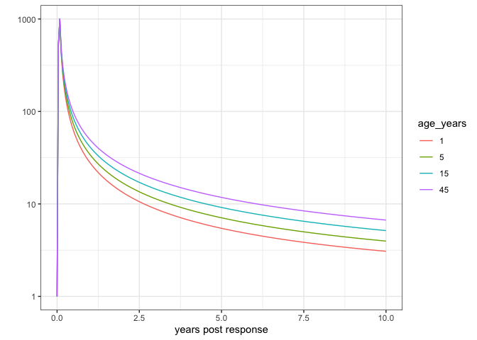
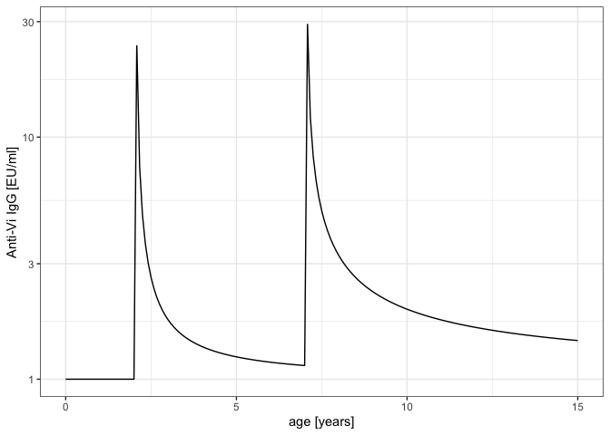
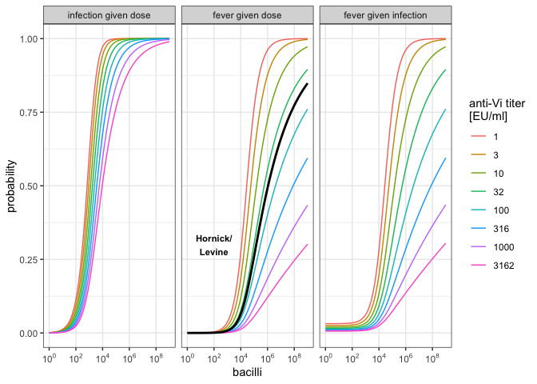
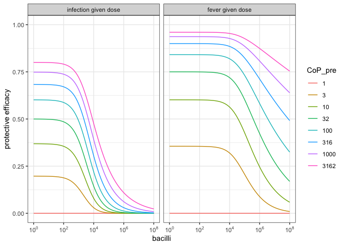

# A view over the horizon: cohort incidence model

After spending a lot of time with the primary literature on typhoid
vaccine efficacy, correlates of protection, natural immunity, dose
response from human challenge studies, seroepidemiology studies, and a
lot of thinking, my manager Edward Wenger *encouraged* me to just do the
thing. This script is the central artifact of that push.

**What?** Implement the new intrahost immunity model in the context of a
constant force-of-infection cohort model. Show that I can reproduce
medium, high, and very high incidence archetypes being considered by a
WHO-organized modeling consortium exercise. Other than the waning model,
which was calibrated to organized and specific data with a simple
log-least-squares approach all default parameters are currently
hand-tuned by me, triangulating across various observations I’ll try to
summarize below.

**What did I learn?** It works! The model can accomodate a bunch of
non-trivial observations across a diversity of sources and settings.
And, having the model prototype with a bunch of outputs has enabled a
lot of rich back and forth with Kyra Grantz that’s already making this
model better and asking important questions of this new model, their
current model, and other sources of data and inferences about how
typhoid works.

**What’s next?** Put the model into Typhoidsim. Get serious about
calibration and applying it to vaccine policy questions. Iterate on many
science questions and additional model features around shedding.

<!-- more -->

## Outline

In this script, I’ll set up the immunity model and then embed it in a
cohort model. I’ll quickly document decisions and questions along the
way, leaving breadcrumbs for better documentation and future iterations
later on. After the setup, we’ll take it for a spin and see a bunch of
things it can do! Along the way, I’ll leave notes about the contrasts
with established models and problems or open questions with this one.
Enjoy!

## The code

First, let’s get some boilerplate out of the way and set up our
environment.

    # imports
    library(tidyverse)
    library(patchwork)
    library(ggridges)

    # age width function
    # I use this later to re-extract age_group widths from a cut() call
    age_width = function(age_group,age_max){
      round(as.numeric(as.character(fct_recode( age_group,
                                                `2`='[0,2]',`3`='(2,5]',`5`='(5,10]',`5.1`='(10,15]',!!as.character(age_max-15):=paste('(15,',age_max,']',sep='')))))
    }

## Intrahost immunity model functions

The immunity model uses anti-Vi IgG ELISA titers as a correlate of
protection from infection and from fever, through the effect of immunity
on susceptibility as a function of bacterial dose. It is based on the
data described
[here](/docs/Literature%20Review/typhoid-vaccine-efficacy) and other
references not yet documented (especially human challenge studies with
data on shedding and disease).

The **titer response function** describes the time dynamics of the
correlate of protection (CoP). In this prototype, we assume no
individual-level variation—everyone has identical responses to identical
exposures and initial conditions. The titer response rises over 30.4
days (conveniently a month for simulation purposes, but ~28 days to peak
is probably ever so slightly more realistic.)

By assumption, the initial unexposed baseline value of the correlate of
protection is set to 1. The most common assay (VaccZyme Anti-Vi IgG) has
a limit of detection (LOD) of 7 EU/ml, so I don’t know the baseline for
sure. But modeling the censoring seems to say 1 works pretty well and
also I don’t think it matters because of how the fold-rise model (to
come) works. (Any lower number will get multiplied by a higher number
above LOD and end up back in the observable range.) The peak CoP default
is set to 1000 until otherwise specified by the fold-rise model. The
long-time power-law exponent *α*, the reference short-time decay
constant *T**d**e**c**a**y*, and the age-dependency
coefficients on them are fit to titer data, to be explained another day.
The initial rise parameters are all just picked to be about right/pretty
because they have no effect on the rest of the model.

    # titer response function
    titer_vs_time = function(t,age_years, CoP_peak=1000, CoP_pre=1,
                             T_decay=11, alpha=1.16,
                             beta_T_decay_age=0.057, beta_alpha_age=-0.060,
                             CoP_min=1,T_rise=1.5,t_start=3,t_peak=30.4){
      
      Tda = T_decay * exp(beta_T_decay_age * age_years)
      ka = alpha * exp(beta_alpha_age * age_years)
      
      # power law decay
      titer = CoP_min + (CoP_peak-CoP_min)*(1+(t-t_peak)/(ka*Tda))^(-ka)
      
      # simple logistic interpolator rise (this is just for continuity/realism. plays no role in the model)
      titer[t<t_peak ] =
        CoP_pre + (CoP_peak-CoP_pre)*
        (1/(1+exp(-(t[t<t_peak] - t_start*5)/T_rise)) - 1/(1+exp(-(0-t_start*5)/T_rise)))/
        (1/(1+exp(-(t_peak - t_start*5)/T_rise)) - 1/(1+exp(-(0-t_start*5)/T_rise)))
      
      return(titer)
    }

    expand.grid(t=seq(0,10,by=1/24), age_years = factor(c(1,5,15,45))) |> 
      mutate(titer = titer_vs_time(t=t*365,age=as.numeric(age_years))) |>
      ggplot() +
      geom_line(aes(x=t,y=titer,color=age_years)) + 
      theme_bw() + scale_y_continuous(trans='log10') + xlab('years post response') + ylab('')

The **fold-rise model** describes the CoP response after an immunizing
event, given the pre-challenge CoP. The default for
*C**o**P**m**a**x*, the maximum possible titer (discussed
[here](https://famulare.github.io/2024/03/07/Conjecture-the-maximum-NAb-titer.html))
comes from an analysis of pre-post vaccine responses, and the default
*m**u*0 parameter is set by a loosely informed guess from [a
model of pre-post infection
dynamics](https://www.thelancet.com/journals/lanmic/article/PIIS2666-5247(22)00114-8/fulltext#fig3)
and triangulating some vaccine study control groups, all to be explained
another day.

    # fold-rise model. defaults set to natural immunity defaults
    fold_rise_model = function(CoP_pre,
                               mu_0=2.5,
                               CoP_max=10^3.5, CoP_min=1){
      fold_rise = 10^(mu_0*(1-(log10(CoP_pre)-log10(CoP_min))/(log10(CoP_max)-log10(CoP_min))))
      return(fold_rise)
    }

    pl_df=expand.grid(CoP_pre=10^seq(0,3.5,by=0.1)) |> 
      mutate(fold_rise = fold_rise_model(CoP_pre=CoP_pre)) |>
      mutate(CoP_post = fold_rise * CoP_pre) 
    (ggplot(pl_df) +
      geom_line(aes(x=CoP_pre,y=fold_rise)) +
      theme_bw() + scale_y_continuous(trans='log10') + scale_x_continuous(trans='log10') +
      xlab('pre-challenge titer') + ylab('fold-rise')) +
      (ggplot(pl_df) +
         geom_line(aes(x=CoP_pre,y=CoP_post)) +
         theme_bw() + scale_y_continuous(trans='log10') + scale_x_continuous(trans='log10') +
         xlab('pre-challenge titer') + ylab('post-challenge titer'))

The fold-rise model combines with the titer vs. time model to give the
immune response over a lifetime of infection (in this case, or
vaccination too but not shown here). As an example, here’s an unlucky
person infected on their 2nd birthday and again on their 7th.

    data.frame(t=seq(0,15,by=1/12), titer=1) |> 
      mutate(titer = if_else(t<=2, titer, 
                             titer_vs_time(t=(t-2)*365,age=2,
                                           CoP_pre=titer[t==2],
                                           CoP_peak = titer[t==2]*fold_rise_model(CoP_pre = titer[t==2])))) |>
      mutate(titer = if_else(t<=7, titer, 
                             titer_vs_time(t=(t-7)*365,age=7,
                                           CoP_pre=titer[t==7],
                                           CoP_peak = titer[t==7]*fold_rise_model(CoP_pre = titer[t==7])))) |>
      ggplot() +
      geom_line(aes(x=t,y=titer)) + 
      theme_bw() + scale_y_continuous(trans='log10') + xlab('age [years]') + ylab('Anti-Vi IgG [EU/ml]')

We care about titers because we use them as a correlate of protection.
The evidence on typhoid supports that anti-Vi titers are a useful
predictor, and we can encode the affect of prior immunity through that
the the effect of dose, where it’s known from challenge studies that
higher doses are more likely to lead to stool-culture confirmed
infection and fever.

The **dose-response model** as a function of immunity and bacilli eaten
is given below. It’s informed by old challenge studies that measured it
directly in cohorts without well-measured prior immunity, and more
recent studies with naive adults. Parameters are hand-fiddled based on
that an a bunch of other things included vaccines, all to be described
another day.

    # dose response
    p_outcome_given_dose = function(dose=1e4,  CoP_pre=1, outcome = 'fever_given_dose', 
                                    n50_fever_given_dose=27800, alpha_fever_given_dose=0.84, gamma_fever_given_dose=0.4,
                                    n50_infection_given_dose=27800/10,alpha_infection_given_dose = 0.84*2, 
                                    gamma_infection_given_dose=0.4/2. # tweaking from previous hand guess to better match comment from Kyra about their estimate of adult immunity
                                    ){
      
      if(outcome == 'fever_given_dose'){
        
        p = 1 - (1+dose*(2^(1/alpha_fever_given_dose)-1)/n50_fever_given_dose)^(-alpha_fever_given_dose/(CoP_pre^gamma_fever_given_dose))
        
      } else if (outcome == 'infection_given_dose'){
        
        p = 1 - (1+dose*(2^(1/alpha_infection_given_dose)-1)/n50_infection_given_dose)^(-alpha_infection_given_dose/(CoP_pre^gamma_infection_given_dose))
        
      } else if (outcome == 'fever_given_infection'){
        
        p = (1 - (1+dose*(2^(1/alpha_fever_given_dose)-1)/n50_fever_given_dose)^(-alpha_fever_given_dose/(CoP_pre^gamma_fever_given_dose))) /
          (1 - (1+dose*(2^(1/alpha_infection_given_dose)-1)/n50_infection_given_dose)^(-alpha_infection_given_dose/(CoP_pre^gamma_infection_given_dose)))
        
      }
      
      return(p)
    }

    expand.grid(dose = 10^seq(0,9,by=0.1),
                CoP_pre = round(10^seq(0,3.5,by=0.5)),
                outcome=factor(c('infection_given_dose','fever_given_dose'),
                               levels=c('infection_given_dose','fever_given_dose','fever_given_infection'))) |>
      group_by(outcome,CoP_pre,dose) |>
      mutate(probability = p_outcome_given_dose(dose=dose,CoP_pre=CoP_pre,outcome = outcome)) |>
      mutate(CoP_pre = factor(CoP_pre)) |>
      ggplot() +
      geom_line(aes(x=dose,y=probability,group=CoP_pre,color=CoP_pre)) +
      facet_grid('~outcome') +
      theme_bw() +
      ylim(c(0,1)) +
      scale_x_continuous(trans='log10', breaks=10^seq(0,10,by=2),minor_breaks = NULL,labels = scales::trans_format("log10", math_format(10^.x)) ) 

The **protective efficacy of prior infection** (in this case, also
vaccine efficacy more generally) is defined as the relative risk
reduction in the outcome (either stool-culture confirmed infection or
fever, but could be other things like seroresponse, bacteremia, and
conversion to carrier status) for a person with a given level of
immunity vs a person who has never been exposed.

\#+ echo=TRUE, message=FALSE, results = ‘hide’

    # protective efficacy vs CoP_pre
    protective_efficacy = function(dose=1e4,  CoP_pre=1, outcome = 'fever_given_dose', CoP_control=1){
      VE = 1 - p_outcome_given_dose(dose,CoP_pre=CoP_pre,outcome = outcome)/p_outcome_given_dose(dose,CoP_pre=CoP_control,outcome = outcome)
      return(VE)
    }

    expand.grid(dose = 10^seq(0,8,by=0.1),
                CoP_pre = round(10^seq(0,3.5,by=0.5)),
                outcome=factor(c('infection_given_dose','fever_given_dose'),
                               levels=c('infection_given_dose','fever_given_dose','fever_given_infection'))) |>
      group_by(outcome,CoP_pre,dose) |>
      mutate(protective_efficacy = protective_efficacy(dose=dose,CoP_pre=CoP_pre,outcome = outcome)) |>
      mutate(CoP_pre = factor(CoP_pre)) |>
      ggplot() +
      geom_line(aes(x=dose,y=protective_efficacy,group=CoP_pre,color=CoP_pre)) +
      facet_grid('~outcome') +
      theme_bw() +
      ylim(c(0,1)) +
      scale_x_continuous(trans='log10', breaks=10^seq(0,10,by=2),minor_breaks = NULL,labels = scales::trans_format("log10", math_format(10^.x)) ) 

The really interesting thing about this kind of model is that it
captures how high doses can overwhelm prior immunity and reduce
efficacy. This effect is critical for typhoid epidemiology, where
exposures can vary by a factor of 1000 or more across settings in time
and place, but is missing from the standard logistic regression
approaches to modeling efficacy vs CoP that are standard in vaccinology
(and which this model reduces to in the low dose limit.)

## Cohort incidence model

    ##### wrap the cohort model in a function
    cohort_model = function(exposure_dose,exposure_rate,
                            N=1000,age_max=75,
                            titer_dt=365/12, # monthly timesteps so I don't have to worry about blocking reinfection during current infection
                            max_titer_id = 1000 # saving every titer above ~1000 gets really slow
                            ){
      
      simulation_months = seq(0,age_max*12-1,by=1)
      
      # titer tracker
      titer_df = expand.grid(id=1:max_titer_id, 
                             month=simulation_months,
                             titer=1) |>
        mutate(age_years=month/12,
               age_group=cut(age_years,breaks=c(0,2,5,10,15,age_max),include.lowest = TRUE)) |>
        mutate(age_width = age_width(age_group,age_max))
      
      # disease events tracker
      events_list =  replicate(N, list(exposure_month = NULL, exposure_count=NULL,
                                       infected = NULL, 
                                       fever = NULL), 
                               simplify = FALSE)
      
      # age-dependent exposure rate, to account for kids under 2y having less exposure to food and sewage
      exposure_rate_multiplier = c(rep(0.1,13),rep(0.5,12),rep(1,length(simulation_months)-25))
      
      # expose
      for (id in (1:N)){
        tmp_exposed = rpois(length(exposure_rate_multiplier),exposure_rate*exposure_rate_multiplier)
        events_list[[id]]$exposure_month = which(tmp_exposed>0)
        events_list[[id]]$exposure_count = tmp_exposed[events_list[[id]]$exposure_month]
        
        # declare needed fields
        events_list[[id]]$infected = rep(0, length(events_list[[id]]$exposure_month))
        events_list[[id]]$fever = rep(0, length(events_list[[id]]$exposure_month))
      }
      
      # infect and titer
      for (id in (1:N)){
        
        tmp_titer =rep(1,length(simulation_months))
        
        if (length(events_list[[id]]$exposure_month) >0){
          for (k in 1:length(events_list[[id]]$exposure_month)){
            
            exposure_month = events_list[[id]]$exposure_month[k]
            
            p_once = p_outcome_given_dose(dose=exposure_dose,CoP_pre=tmp_titer[exposure_month],outcome='infection_given_dose')
            p_inf = 1-(1-p_once)^events_list[[id]]$exposure_count[k]
            
            if(runif(1)>p_inf){
              events_list[[id]]$infected[k] = 0
              events_list[[id]]$fever[k]    = 0
            } else {
              
              # update infection list
              events_list[[id]]$infected[k]=1
              
              # update fever list 
              p_fever = p_outcome_given_dose(dose=exposure_dose,CoP_pre=tmp_titer[exposure_month],outcome='fever_given_infection')
              if (runif(n=1)<=p_fever){
                events_list[[id]]$fever[k]=1
              } else {
                events_list[[id]]$fever[k]=0
              }
              
              tmp_titer[exposure_month:length(tmp_titer)]= titer_vs_time(t=(titer_dt*(simulation_months-exposure_month+1))[(exposure_month):length(simulation_months)],
                                                                   age_years = exposure_month/12,
                                                                   CoP_pre = tmp_titer[exposure_month],
                                                                   CoP_peak=tmp_titer[exposure_month]*fold_rise_model(CoP_pre = tmp_titer[exposure_month]))
              tmp_titer[exposure_month:length(tmp_titer)] = round(tmp_titer[exposure_month:length(tmp_titer)],2)
            }
            
          }
          
          if(id <= max_titer_id){
            idx = titer_df$id == id
            titer_df$titer[idx] = tmp_titer
          }
        }
      }
      
      # make the events_list into a nice data frame
      not_empty_idx = which(!sapply(events_list, function(x){ is_empty(x$exposure_month)}))
      events_df = tibble(id = not_empty_idx, data = events_list[not_empty_idx]) |>
        unnest_wider(data) |>
        unnest_longer(c(exposure_month,exposure_count,infected,fever), keep_empty = TRUE) |>
        mutate(exposure_age=exposure_month/12,
               age_group=cut(exposure_age,breaks=c(0,2,5,10,15,age_max),include.lowest = TRUE)) |>
        mutate(age_width=age_width(age_group,age_max)) |>
        group_by(id) |>
        mutate(infection_age = if_else(infected==1,exposure_age,NA)) |>
        mutate(fever_age = if_else(fever==1,exposure_age,NA)) |>
        mutate(infected = factor(infected),
               fever = factor(fever)) |>
        mutate(outcome = interaction(infected,fever)) |>
        mutate(outcome = fct_recode(outcome,exposed='0.0',infected='1.0',fever='1.1')) |>
        mutate(outcome = factor(outcome,levels=c('exposed', 'infected', 'fever')))

      # combine some events with titer for plotting
      titer_df = titer_df |>
        left_join(events_df |> select(id,infection_age,infected,fever) |> 
                    # mutate(fever = if_else(is.na(fever),0,fever)) |>
                    drop_na(infected),by=join_by(id ==id, age_years == infection_age))

      return(list(titer_df=titer_df,
                  events_df=events_df,
                  config=data.frame(exposure_dose,exposure_rate,N,age_max,titer_dt)))
      
    }

    ###### run the model for the three different reference incidence levels

    # define setting ecology: exposure rate and dose

    if (!file.exists('scratch/output_cache.RData')){
      output=list()
      
      # N_cohort=2e4 # a lot faster for playing
      N_cohort=1e6 # made huge to get good stats at lower incidence
      
      # medium
      output[['medium']] = cohort_model(exposure_dose = 5e2,
                                        exposure_rate=1/(12*40), # per month
                                        N=N_cohort)
      
      # high
      output[['high']] = cohort_model(exposure_dose = 5e3,
                                      exposure_rate=1/(12*20), # per month
                                      N=N_cohort/5)
      
      # very high
      output[['very_high']] = cohort_model(exposure_dose = 5e4,
                                           exposure_rate=1/(12*20), # per month
                                           N=N_cohort/10)
      
      save(output,N,file='scratch/output_cache.RData')
    } else {
      load(file='scratch/output_cache.RData')  
    }

    # plots 

    # incidence targets
    incidence_fever_targets = c(medium = 53,high=214,very_high=1255)

    # calculate incidence
    for (k in 1:length(output)){
      
      N = output[[k]]$config$N
      
      output[[k]]$incidence_vs_age =
        output[[k]]$events_df |> group_by(age_group) |>
        summarize(incidence_fever = sum(fever==1)/(N*unique(age_width))*1e5,
                  incidence_infection = sum(infected==1)/(N*unique(age_width))*1e5,
                  symptomatic_fraction = sum(fever==1,na.rm=TRUE)/sum(infected==1,na.rm=TRUE),
                  age_width = unique(age_width)) |>
        mutate(incidence_fever_overall = sum(incidence_fever*age_width/sum(age_width)),
               incidence_infection_overall = sum(incidence_infection*age_width/sum(age_width)),
               incidence_fever_target = incidence_fever_targets[names(output)[k]])
    }

    ##### make lots of plots

    p_incidence_fever=list()
    p_incidence_infection=list()
    p_symptomatic_fraction=list()
    for (k in 1:length(output)){
      p_incidence_fever[[k]]=ggplot(output[[k]]$incidence_vs_age) +
        geom_bar(aes(x=age_group,y=incidence_fever),stat='identity') +
        geom_hline(aes(yintercept=incidence_fever_overall[1]),linetype='solid') +
        geom_hline(aes(yintercept=incidence_fever_target[1]),linetype='dashed') +
        theme_bw() +
        xlab('') +
        ylab('annual incidence of fever per 100k') +
        labs(title = paste(sub('_',' ',names(output)[k]),' incidence',sep=''),
             subtitle=paste('dose = ',output[[k]]$config$exposure_dose,' bacilli\nmean years b/w exposures = ',
                            1/(12*output[[k]]$config$exposure_rate),sep='')) +
        theme(plot.title=element_text(size=10),plot.subtitle=element_text(size=8),
              axis.title = element_text(size=10))
      
      p_incidence_infection[[k]]=ggplot(output[[k]]$incidence_vs_age) +
        geom_bar(aes(x=age_group,y=incidence_infection),stat='identity') +
        geom_hline(aes(yintercept=incidence_infection_overall[1]),linetype='solid') +
        theme_bw() +
        xlab('') +
        ylab('annual incidence of infection per 100k') +
        labs(title = paste(sub('_',' ',names(output)[k]),' incidence',sep=''),
             subtitle=paste('dose = ',output[[k]]$config$exposure_dose,' bacilli\nmean years b/w exposures = ',
                            1/(12*output[[k]]$config$exposure_rate),sep='')) +
        theme(plot.title=element_text(size=10),plot.subtitle=element_text(size=8),
              axis.title = element_text(size=10))
      
      p_symptomatic_fraction[[k]]=ggplot(output[[k]]$incidence_vs_age) +
        geom_bar(aes(x=age_group,y=symptomatic_fraction),stat='identity') +
        theme_bw() +
        xlab('') +
        ylab('symptomatic fraction') +
        ylim(c(0,1)) +
        labs(title = paste(sub('_',' ',names(output)[k]),' incidence',sep=''),
             subtitle=paste('dose = ',output[[k]]$config$exposure_dose,' bacilli\nmean years b/w exposures = ',
                            1/(12*output[[k]]$config$exposure_rate),sep='')) +
        theme(plot.title=element_text(size=10),plot.subtitle=element_text(size=8),
              axis.title = element_text(size=10))
    }

    wrap_plots(p_incidence_fever) + plot_layout(guides = "collect",axes='collect')

    ggsave('scratch/figures/cohort_model_incidence_fever_by_age.png',units='in',width=7,height=4)

    wrap_plots(p_incidence_infection) + plot_layout(guides = "collect",axes='collect')

    ggsave('scratch/figures/cohort_model_incidence_infection_by_age.png',units='in',width=7,height=4)

    wrap_plots(p_symptomatic_fraction) + plot_layout(guides = "collect",axes='collect')

    ggsave('scratch/figures/cohort_model_symptomatic_fraction.png',units='in',width=7,height=4)

    p_exposure=list()
    for (k in 1:length(output)){
      p_exposure[[k]] = ggplot(output[[k]]$events_df |> filter(id<=40)) +
                          geom_point(aes(x=exposure_age,color=outcome,y=id)) +
                          theme_bw() +
                          xlab('age') +
          labs(title = paste(sub('_',' ',names(output)[k]),' incidence',sep=''),
                  subtitle=paste('dose = ',output[[k]]$config$exposure_dose,' bacilli\nmean years b/w exposures = ',
                        1/(12*output[[k]]$config$exposure_rate),sep='')) +
        theme(plot.title=element_text(size=10),plot.subtitle=element_text(size=8),
              axis.title = element_text(size=10)) +
        scale_color_discrete(drop = FALSE)
    }
    wrap_plots(p_exposure) + plot_layout(guides = "collect",axes='collect')

    ggsave('scratch/figures/cohort_model_individual_level_exposure_examples.png',units='in',width=7,height=6)

    p_titer_examples=list()
    for (k in 1:length(output)){
      p_titer_examples[[k]] = ggplot() +
        geom_line(data=output[[k]]$titer_df |> filter(id<=20),aes(x=age_years,y=titer)) + 
        geom_point(data=output[[k]]$titer_df |> filter(id<=20) |> filter(!is.na(infected)),
                   aes(x=age_years,y=titer,color=fever)) +
        scale_y_continuous(trans='log10',limits=c(1,10^3.5)) +
        facet_wrap('id') +
        theme_bw() +
        xlab('age') +
        labs(title = paste(sub('_',' ',names(output)[k]),' incidence',sep=''),
             subtitle=paste('dose = ',output[[k]]$config$exposure_dose,' bacilli\nmean years b/w exposures = ',
                            1/(12*output[[k]]$config$exposure_rate),sep='')) +
        theme(plot.title=element_text(size=10),plot.subtitle=element_text(size=8),
              axis.title = element_text(size=10))  +
        scale_color_discrete(drop = FALSE)
    }
    wrap_plots(p_titer_examples) + plot_layout(guides = "collect",axes='collect')

    ggsave('scratch/figures/cohort_model_individual_level_titer_examples.png',units='in',width=12,height=6)

    p_titer_summary=list()
    p_titer_density=list()
    p_protective_efficacy_summary=list()
    for (k in 1:length(output)){
      
      exposure_dose = output[[k]]$config$exposure_dose
      
      tmp_titer_summary =output[[k]]$titer_df |>
        mutate(protective_efficacy = protective_efficacy(dose = exposure_dose,CoP_pre = titer, outcome='infection_given_dose')) |>
        group_by(age_years) |>
        summarize(titer_gmt = exp(mean(log(titer))),
               titer_median = median(titer),
               titer_upper_iqr = quantile(titer,probs=0.75),
               titer_lower_iqr = quantile(titer,probs=0.25),
               titer_upper_95 = quantile(titer,probs=0.975),
               titer_lower_95 = quantile(titer,probs=0.025),
               protective_efficacy_median = median(protective_efficacy),
               protective_efficacy_upper_iqr = quantile(protective_efficacy,probs=0.75),
               protective_efficacy_lower_iqr = quantile(protective_efficacy,probs=0.25),
               protective_efficacy_upper_95 = quantile(protective_efficacy,probs=0.975),
               protective_efficacy_lower_95 = quantile(protective_efficacy,probs=0.025))
      
      p_titer_summary[[k]] = ggplot(tmp_titer_summary) +
        geom_ribbon(aes(x=age_years,ymin=titer_lower_95,ymax=titer_upper_95),alpha=0.2)+
        geom_ribbon(aes(x=age_years,ymin=titer_lower_iqr,ymax=titer_upper_iqr),alpha=0.2)+
        geom_line(aes(x=age_years,y=titer_median)) + 
        geom_line(aes(x=age_years,y=titer_gmt),linetype='dashed') + 
        scale_y_continuous(limits=c(1,10^3.5)) +
        theme_bw() +
        xlab('age') +
        labs(title = paste(sub('_',' ',names(output)[k]),' incidence',sep=''),
             subtitle=paste('dose = ',output[[k]]$config$exposure_dose,' bacilli\nmean years b/w exposures = ',
                            1/(12*output[[k]]$config$exposure_rate),sep='')) +
        theme(plot.title=element_text(size=10),plot.subtitle=element_text(size=8),
              axis.title = element_text(size=10)) +
        ylab('anti-Vi IgG EU/ml')
      
      p_protective_efficacy_summary[[k]] = ggplot(tmp_titer_summary) +
        geom_ribbon(aes(x=age_years,ymin=protective_efficacy_lower_95,ymax=protective_efficacy_upper_95),alpha=0.2)+
        geom_ribbon(aes(x=age_years,ymin=protective_efficacy_lower_iqr,ymax=protective_efficacy_upper_iqr),alpha=0.2)+
        geom_line(aes(x=age_years,y=protective_efficacy_median)) + 
        scale_y_continuous(limits=c(0,1)) +
        theme_bw() +
        xlab('age') +
        labs(title = paste(sub('_',' ',names(output)[k]),' incidence',sep=''),
             subtitle=paste('dose = ',output[[k]]$config$exposure_dose,' bacilli\nmean years b/w exposures = ',
                            1/(12*output[[k]]$config$exposure_rate),sep='')) +
        theme(plot.title=element_text(size=10),plot.subtitle=element_text(size=8),
              axis.title = element_text(size=10)) +
        ylab('protective efficacy')
      
      
      sampled_titer_df = output[[k]]$titer_df |>
        group_by(age_group,id) |>
        slice_sample(n=1)
      p_titer_density[[k]] = ggplot(sampled_titer_df) +
        geom_density_ridges(aes(x=titer,y=age_group),scale=0.9,jittered_points = TRUE,bandwidth = 0.1) + 
        scale_x_continuous(trans='log10',limits=c(7,10^3.5)) +
        theme_bw() + 
        xlab('titer, given above limit of detection') +
        ylab('') +
        labs(title = paste(sub('_',' ',names(output)[k]),' incidence',sep=''),
             subtitle=paste('dose = ',output[[k]]$config$exposure_dose,' bacilli\nmean years b/w exposures = ',
                            1/(12*output[[k]]$config$exposure_rate),sep='')) +
        theme(plot.title=element_text(size=10),plot.subtitle=element_text(size=8),
              axis.title = element_text(size=10)) 
    }
    wrap_plots(p_titer_summary) + plot_layout(guides = "collect",axes='collect')

    ggsave('scratch/figures/cohort_model_titer_vs_age_summary.png',units='in',width=7,height=4)

    wrap_plots(p_protective_efficacy_summary) + plot_layout(guides = "collect",axes='collect')

    ggsave('scratch/figures/cohort_model_protective_efficacy_infection_vs_age_summary.png',units='in',width=7,height=4)

    wrap_plots(p_titer_density) + plot_layout(guides = "collect",axes='collect')

    ## Warning: Removed 4856 rows containing non-finite outside the scale range (`stat_density_ridges()`).

    ## Warning: Removed 4080 rows containing non-finite outside the scale range (`stat_density_ridges()`).

    ## Warning: Removed 3785 rows containing non-finite outside the scale range (`stat_density_ridges()`).

    ggsave('scratch/figures/cohort_model_titer_density.png',units='in',width=7,height=4)

    ## Warning: Removed 4856 rows containing non-finite outside the scale range (`stat_density_ridges()`).

    ## Warning: Removed 4080 rows containing non-finite outside the scale range (`stat_density_ridges()`).

    ## Warning: Removed 3785 rows containing non-finite outside the scale range (`stat_density_ridges()`).
