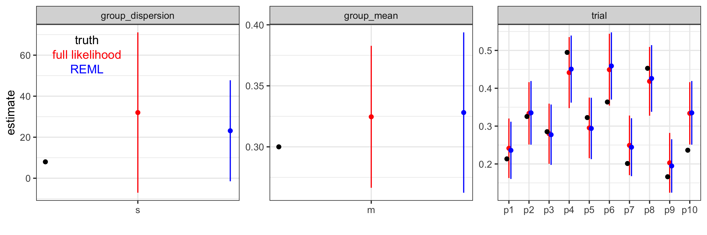

# Hand rolling empirical Bayes estimation of a hierarchical model to learn how it works

This is a quick experiment to teach myself if I can just use full
likelihood optimization to get well-behaved empirical Bayes estimate of
both the trial-level random effects and the metastudy group-level
hyperparameters in a mixed model.

**Why?** Because proper statisticians say you aren’t supposed to use a
full likelihood to estimate random effects and hyperparameters because
it’s biased for the group-level variance components, but how much does
it matter for model fitting metastudy applications?

<!-- more -->

I care because I like to use simple optimizations when initially
calibrating models on the kind of strange data types I get from papers
when I don’t have the individual-level data. I want to better understand
when I can take shortcuts and still get decent statistical properties
during model development. Then, if doing the stats better proves to be
important, relative to other limitations of the model, we can do better
later.

Also, I use packages to do mixed-effects modeling all the time, but I’ve
never worked out a non-Gaussian example. That is not a
morally-sustainable position.

**What?** Compare full maximum likelihood (ML) estimate where I jointly
optimize over the subject-level random effects and the group level
hyperparameters, vs the restricted maximum likelihood (REML) estimate
where I first optimize only over the hyperparamaters and then find an
empirical Bayes estimate of the random effects given the
hyperparameters.  
For the best tight description of the two algorithms that I’ve found,
see this documentation for [Estimating Parameters in Linear
Mixed-Effects Models from The
Mathworks](https://www.mathworks.com/help/stats/estimating-parameters-in-linear-mixed-effects-models.html).

**What did I learn?** WHELP, it looks full likelihood optimization is
just fine, at least for this example, which is on a relevant scale for a
vaccine model building metastudy. (Of order 10 trial arms, with of order
100 subjects per arm, and binary outcomes.)  
I also learned that it was easy to implement the REML approach in this
example. So, if it’s also easy on the real calibration problem to come,
I’ll probably just do that.

To learn more, and very quickly, about what I’m trying to do, here’s a
[useful chat log with
ChatGPT4.5](https://chatgpt.com/share/e/67d487c3-f080-800f-b14f-ce399681d9bc)
to go along with this.

**What am I looking for from you?** I’ve learned a lot of stats over the
last 15 years, but I’m not trained as a statistician and I’m always
learning more. Please comment if you see anything you’d like to correct
or expand upon. Also, let me know if this was useful to you. Thanks!

**Note about how this post was generated.** This post was generated
directly from the commented R script using the `knitr::spin`
functionality of `rmarkdown::render`. This gives all the advantages of
scripts and r-markdown, without the disadvantages. Check out this [blog
post by Dean
Attali](https://deanattali.com/2015/03/24/knitrs-best-hidden-gem-spin/)
to learn more.

## Setting up the study

First, we set up a study with 10 trial arms and 100 people measured per
arm. The group level is the ensemble of trial arms, and the individuals
in this exmaple are the trial arms. The observations for each trial arm
are zero or one for the outcome, and each arm has a true probability of
the outcome drawn from a beta distribution for the ensemble of studies.
Note that this isn’t set up as real vaccine efficacy measurement. I’m
just interested in looking at cohort parameter estimation for now. VE
would be a transform on that, if the arms were labeled by treatment vs
control.

    # set up the environment
    library(tidyverse)
    library(rmutil)
    library(stats4)
    library(knitr)

    # set seed for reproducibility. Comment out to run many examples to see that this example is representative.
    set.seed(100)

    ##simulate binomial draws from a beta random-effects model
    # typical example of a metastudy, 10 trials, ~100 subjects per trial
    n_trials = 10 # don't change! I hard-coded 10 later for dumb reasons w/r/t variable names in stats4::mle that I didn't feel like debugging.
    n_subjects=100 # you can change this if you want.

    # set up the measurement-level data frame
    subjects = expand_grid(ID=1:n_trials,rep = 1:n_subjects)

    ## draw probability of positive for each ID from a beta distribution

    # rmutil::betabinomial parameterization
    m=0.3
    s=8

    # rbeta parameterization
    alpha=m*s
    beta=s-alpha

    # add true trial-level outcome probality to the subject data
    subjects = subjects |> left_join(
      data.frame(ID=1:n_trials,p=rbeta(n_trials,shape1=alpha,shape2=beta)))

    # draw binomial samples for each subject
    subjects = subjects |> cbind(
      data.frame(response=rbinom(n=nrow(subjects),size=1,prob=subjects$p)))

    # collapse the measurement-level data into subject level data for fitting later
    observed = subjects |> group_by(ID,p) |>
                summarize(n_pos=sum(response),
                          n_trials=n(),
                          p_hat = n_pos/n_trials)

    observed |> kable()

<table>
<thead>
<tr class="header">
<th style="text-align: right;">ID</th>
<th style="text-align: right;">p</th>
<th style="text-align: right;">n_pos</th>
<th style="text-align: right;">n_trials</th>
<th style="text-align: right;">p_hat</th>
</tr>
</thead>
<tbody>
<tr class="odd">
<td style="text-align: right;">1</td>
<td style="text-align: right;">0.2134503</td>
<td style="text-align: right;">22</td>
<td style="text-align: right;">100</td>
<td style="text-align: right;">0.22</td>
</tr>
<tr class="even">
<td style="text-align: right;">2</td>
<td style="text-align: right;">0.3254404</td>
<td style="text-align: right;">34</td>
<td style="text-align: right;">100</td>
<td style="text-align: right;">0.34</td>
</tr>
<tr class="odd">
<td style="text-align: right;">3</td>
<td style="text-align: right;">0.2853022</td>
<td style="text-align: right;">27</td>
<td style="text-align: right;">100</td>
<td style="text-align: right;">0.27</td>
</tr>
<tr class="even">
<td style="text-align: right;">4</td>
<td style="text-align: right;">0.4947419</td>
<td style="text-align: right;">48</td>
<td style="text-align: right;">100</td>
<td style="text-align: right;">0.48</td>
</tr>
<tr class="odd">
<td style="text-align: right;">5</td>
<td style="text-align: right;">0.3225656</td>
<td style="text-align: right;">29</td>
<td style="text-align: right;">100</td>
<td style="text-align: right;">0.29</td>
</tr>
<tr class="even">
<td style="text-align: right;">6</td>
<td style="text-align: right;">0.3637010</td>
<td style="text-align: right;">49</td>
<td style="text-align: right;">100</td>
<td style="text-align: right;">0.49</td>
</tr>
<tr class="odd">
<td style="text-align: right;">7</td>
<td style="text-align: right;">0.2012123</td>
<td style="text-align: right;">23</td>
<td style="text-align: right;">100</td>
<td style="text-align: right;">0.23</td>
</tr>
<tr class="even">
<td style="text-align: right;">8</td>
<td style="text-align: right;">0.4527466</td>
<td style="text-align: right;">45</td>
<td style="text-align: right;">100</td>
<td style="text-align: right;">0.45</td>
</tr>
<tr class="odd">
<td style="text-align: right;">9</td>
<td style="text-align: right;">0.1662158</td>
<td style="text-align: right;">17</td>
<td style="text-align: right;">100</td>
<td style="text-align: right;">0.17</td>
</tr>
<tr class="even">
<td style="text-align: right;">10</td>
<td style="text-align: right;">0.2363248</td>
<td style="text-align: right;">34</td>
<td style="text-align: right;">100</td>
<td style="text-align: right;">0.34</td>
</tr>
</tbody>
</table>

## Parameter inference with the full likelihood

The first approach I’m considering is maximum likelihood estimation of
both the population-level hyperparameters and the trial-level outcome
probabilities. We can estimate both the MLE and the Wald confidence
intervals from the variance-covariance matrix using
[`stats4::mle`](https://www.rdocumentation.org/packages/stats4/versions/3.6.2/topics/mle).
In the code chunk below, I define the likelihood function, run the
optimization (using `method = 'L-BFGS-B` with appropriate bounds to
respect parameter domains), and tidy up the results for display and
plotting later.

    # define the negative log likelihood for the fully parameterized model: beta-distributed population + individial binomial probabilities
    # Note that I'm hardcoding data for this demo so I don't have to worry about passing data to mle later. This is for convenience.
    minus_log_lik = function(m=alpha/(alpha+beta),s=(alpha+beta),
                             p1=observed$p[1],p2=observed$p[2],p3=observed$p[3],p4=observed$p[4], # there's surely a nicer way to do this...
                             p5=observed$p[5],p6=observed$p[6],p7=observed$p[7],p8=observed$p[8],
                             p9=observed$p[9],p10=observed$p[10]){
      a = m*s
      b = s-a
      p =c(p1,p2,p3,p4,p5,p6,p7,p8,p9,p10)
      
      -sum(dbeta(x=p,shape1=a,shape2=b,log=TRUE) + dbinom(x=observed$n_pos,size=observed$n_trials,prob=p,log=TRUE))
    } 
    minus_log_lik()

    # find the maximum likelihood estimate simulateously for both the trial-level random effects and the hyperparameters.
    model_lik = stats4::mle(minus_log_lik, start = list(m=0.5,s=10,p1=0.5,p2=0.5,p3=0.5,p4=0.5,
                                                        p5=0.5,p6=0.5,p7=0.5,p8=0.5,p9=0.5,p10=0.5),
                            method='L-BFGS-B',
                            upper=c(0.99999,Inf,0.99999,0.99999,0.99999,0.99999,0.99999,0.99999,0.99999,0.99999,0.99999,0.99999),
                            lower=c(0.00001,0,0.00001,0.00001,0.00001,0.00001,0.00001,0.00001,0.00001,0.00001,0.00001,0.00001))
    summary(model_lik)

    # tidy up the results for display and later plotting
    full_lik_params = data.frame(true=c(m=m,s=s,observed$p), estimate =coef(model_lik),  se = sqrt(diag(vcov(model_lik )))) |>
      mutate( z = (true-estimate)^2/se^2,
              lower = estimate - 1.96*se, # wald confidence interval
              upper = estimate + 1.96*se) |>
      rownames_to_column(var='param') |>
      select(param, everything()) |> 
      mutate(param=factor(param,levels=c('m','s','p1','p2','p3','p4','p5','p6','p7','p8','p9','p10'))) |>
      mutate(level=factor(c('group_mean','group_dispersion',rep('trial',10)))) |>
      mutate(param_index = 1:12)

    full_lik_params

    ##    param      true   estimate          se          z      lower      upper            level param_index
    ## 1      m 0.3000000  0.3246235  0.02967484 0.68853213  0.2664609  0.3827862       group_mean           1
    ## 2      s 8.0000000 32.0202634 19.93898104 1.45127465 -7.0601394 71.1006663 group_dispersion           2
    ## 3     p1 0.2134503  0.2414595  0.04012803 0.48719936  0.1628086  0.3201105            trial           3
    ## 4     p2 0.3254404  0.3337523  0.04203733 0.03909562  0.2513592  0.4161455            trial           4
    ## 5     p3 0.2853022  0.2799146  0.04053223 0.01766756  0.2004715  0.3593578            trial           5
    ## 6     p4 0.4947419  0.4414270  0.04786335 1.24076659  0.3476149  0.5352392            trial           6
    ## 7     p5 0.3225656  0.2952969  0.04085350 0.44552396  0.2152241  0.3753698            trial           7
    ## 8     p6 0.3637010  0.4491181  0.04839787 3.11484948  0.3542583  0.5439780            trial           8
    ## 9     p7 0.2012123  0.2491503  0.04016259 1.42467515  0.1704316  0.3278690            trial           9
    ## 10    p8 0.4527466  0.4183538  0.04634406 0.55074260  0.3275194  0.5091881            trial          10
    ## 11    p9 0.1662158  0.2030039  0.04030446 0.83312302  0.1240072  0.2820006            trial          11
    ## 12   p10 0.2363248  0.3337523  0.04203733 5.37146452  0.2513592  0.4161455            trial          12

## Parameter inference with REML and empirical Bayes

Before looking to closely at the results, let’s look at the other
(statistician-preferred) approach of estimating the hyperparameters
first with the trial-level random effects integrated out, and then
estimating the trial-level random effects given the hyperparameter MLEs.

For the beta-binomial model, the restricted likelihood is just the
analytic betabinomial distribution, which I wrap into a negative log
likelhood for fitting.

    # hyperparameter likelihood
    minus_log_REML = function(m=alpha/(alpha+beta),s=(alpha+beta)){
      -sum(rmutil::dbetabinom(y=observed$n_pos,size=observed$n_trials,m=m,s=s,log=TRUE))
    }
    minus_log_REML()

    # hyperparameter MLE
    model_REML = stats4::mle(minus_log_REML, start = list(m=0.5,s=1),
                method='L-BFGS-B',
                upper=c(0.99999,Inf),
                lower=c(0.00001,0))

    summary(model_REML)

Next, given the MLEs for the hyperparameters, I estimate the trial-level
outcome probabilities and tidy up all the results.

    # empirical Bayes likelihood for the individual-level random effects. Plug in MLE of the hyperparameters.
    minus_log_REML_p = function(p1=observed$p[1],p2=observed$p[2],p3=observed$p[3],p4=observed$p[4], # there's probably a nicer way to do this...
                                p5=observed$p[5],p6=observed$p[6],p7=observed$p[7],p8=observed$p[8],
                                p9=observed$p[9],p10=observed$p[10]){
      
      a = coef(model_REML)[1]*coef(model_REML)[2]
      b = coef(model_REML)[2]-a
      p =c(p1,p2,p3,p4,p5,p6,p7,p8,p9,p10)
      
      -sum(dbeta(x=p,shape1=a,shape2=b,log=TRUE) + dbinom(x=observed$n_pos,size=observed$n_trials,prob=p,log=TRUE))
      
    }
    minus_log_REML_p()

    # estimate the trial-level probabilities
    model_REML_p = stats4::mle(minus_log_REML_p, start = list(p1=0.5,p2=0.5,p3=0.5,p4=0.5,
                                                            p5=0.5,p6=0.5,p7=0.5,p8=0.5,p9=0.5,p10=0.5),
                             method='L-BFGS-B',
                             upper=c(0.99999,0.99999,0.99999,0.99999,0.99999,0.99999,0.99999,0.99999,0.99999,0.99999),
                             lower=c(0.00001,0.00001,0.00001,0.00001,0.00001,0.00001,0.00001,0.00001,0.00001,0.00001))

    summary(model_REML_p)

    # and tidy up the results
    REML_params=data.frame(true=c(m=m,s=s,observed$p), estimate =c(coef(model_REML),coef(model_REML_p)), se = c(sqrt(diag(vcov(model_REML))),sqrt(diag(vcov(model_REML_p))))) |>
      mutate( z = (true-estimate)^2/se^2,
              lower = estimate - 1.96*se,
              upper = estimate + 1.96*se) |>
      rownames_to_column(var='param') |>
      select(param, everything()) |> 
      mutate(param=factor(param,levels=c('m','s','p1','p2','p3','p4','p5','p6','p7','p8','p9','p10'))) |>
      mutate(level=factor(c('group_mean','group_dispersion',rep('trial',10)))) |>
      mutate(param_index = 1:12)

    REML_params

    ##    param      true   estimate          se          z      lower      upper            level param_index
    ## 1      m 0.3000000  0.3280964  0.03351673 0.70271450  0.2624036  0.3937892       group_mean           1
    ## 2      s 8.0000000 23.1436114 12.56215846 1.45321669 -1.4782192 47.7654420 group_dispersion           2
    ## 3     p1 0.2134503  0.2360292  0.03858028 0.34251204  0.1604119  0.3116466            trial           3
    ## 4     p2 0.3254404  0.3350849  0.04288521 0.05057560  0.2510299  0.4191399            trial           4
    ## 5     p3 0.2853022  0.2773025  0.04067250 0.03868527  0.1975843  0.3570206            trial           5
    ## 6     p4 0.4947419  0.4506498  0.04520559 0.95134048  0.3620469  0.5392528            trial           6
    ## 7     p5 0.3225656  0.2938117  0.04138481 0.48273865  0.2126975  0.3749259            trial           7
    ## 8     p6 0.3637010  0.4589045  0.04527371 4.42194639  0.3701680  0.5476410            trial           8
    ## 9     p7 0.2012123  0.2442839  0.03903654 1.21741661  0.1677723  0.3207956            trial           9
    ## 10    p8 0.4527466  0.4258858  0.04492556 0.35748004  0.3378317  0.5139399            trial          10
    ## 11    p9 0.1662158  0.1947565  0.03597917 0.62925532  0.1242373  0.2652756            trial          11
    ## 12   p10 0.2363248  0.3350849  0.04288521 5.30331730  0.2510299  0.4191399            trial          12

## Results

Now that we’ve run both estimation processes, we can compare the results
to each other and the underlying simulated truth.

    ggplot() +
      geom_point(data=full_lik_params,aes(x=param_index,y=estimate),color='red') +
      geom_segment(data=full_lik_params,aes(x=param_index,y=lower,yend=upper,group=param),color='red') +
      geom_point(data=REML_params,aes(x=param_index+0.1,y=estimate),color='blue') +
      geom_segment(data=REML_params,aes(x=param_index+0.1,y=lower,yend=upper,group=param),color='blue') +
      geom_point(data=full_lik_params,aes(x=param_index-0.1,y=true)) +
      theme_bw()+
      facet_wrap('level',scales='free') +
      scale_x_continuous(breaks=seq(1:12),labels=levels(full_lik_params$param),minor_breaks = NULL) +
      xlab('') +
      geom_text(data=data.frame(param_index=rep(1.945,3),y=full_lik_params$upper[2]*c(0.95,0.85,0.75),label=c('truth','full likelihood','REML'),level=rep('group_dispersion',3)),
                aes(x=param_index,y=y,label=label),color=c('black','red','blue'))

In this example, the results are qualitatively similar.

-   Nominal 95% confidence interval coverage is acceptable for my
    purposes for both,

    -   especially as [Wald intervals are known to be too
        narrow](https://math.stackexchange.com/questions/1448233/the-derivation-of-the-wald-interval)
        and don’t enforce that the dispersion hyperparameter must be
        positive because I worked on the outcome scale and not the link
        scale.

-   The trial-level effect estimates and the group-level mean estimates
    are nearly identical.

-   The group-level dispersion parameter is biased high with the full
    likelihood vs the REML estimate, as expected from the stats theory,
    and in this case a bit wider.

## My take-away

The most interesting parameters for the analogous problem in the
immunity modeling building to come are the group-level mean and
trial-level individual effects, both of which are estimated with similar
quality regardless of the method. The group-level dispersion is the
least relevant parameter for that activity, and so I take away that I’m
probably fine to do whatever is easiest to implement.

And regardless, this will be a great place to engage with some peer
review after the model is prototyped, so that we can do better if
needed.

Thanks for reading!
