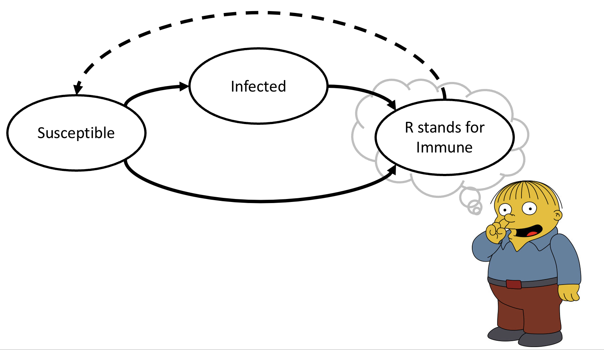

# What is immunity, *really*? (DRAFT)

The first thing anyone learns about epi modeling is how to represent people as "immune" or not. Is anyone either completely immune or not to anything? NO! Let's flesh that out and think through what it means to us, as modelers...

<!-- more -->

To-do:

-   talk through different concepts of immunity

    -   binary as an approximation

    -   immune as an immunologist vs as an epidemiologist or vaccinologist

-   effectiveness vs efficacy, as relevant to model building

-   waning

    -   effectiveness or correlate?

-   sequential response

-   hierarchy of complexity

-   what to do next?
