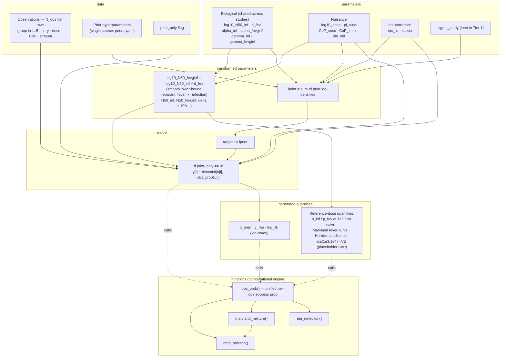
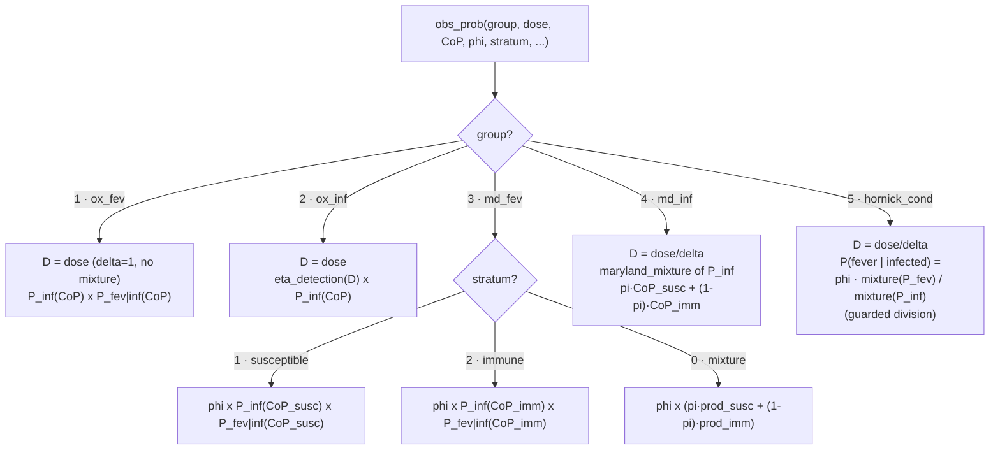

# Stan model structure — `typhoid_dose_response.stan`

Generated 2026-06-26 from [typhoid_dose_response.stan](typhoid_dose_response.stan)
(Tier 2: eta-correction, full complexity). Two views:

1. **Program dataflow** — how the Stan blocks feed each other.
2. **`obs_prob` dispatch** — the scientific core: how each observation
   group maps to a binomial success probability.

Core kernels:

- **beta-Poisson**: `P = 1 - (1 + D_eff·(2^(1/alpha) - 1)/N50)^(-alpha / CoP^gamma)`,
  with `D_eff = D/delta` (caller applies `/delta` where needed).
- **eta detection**: `eta_lo + (1 - eta_lo)·exp(-kappa·D_eff/N50_inf)`.
- **Maryland mixture**: `pi_susc·P(CoP_susc) + (1 - pi_susc)·P(CoP_imm)`.

## 1. Program dataflow

## 2. `obs_prob` group dispatch (likelihood core)

