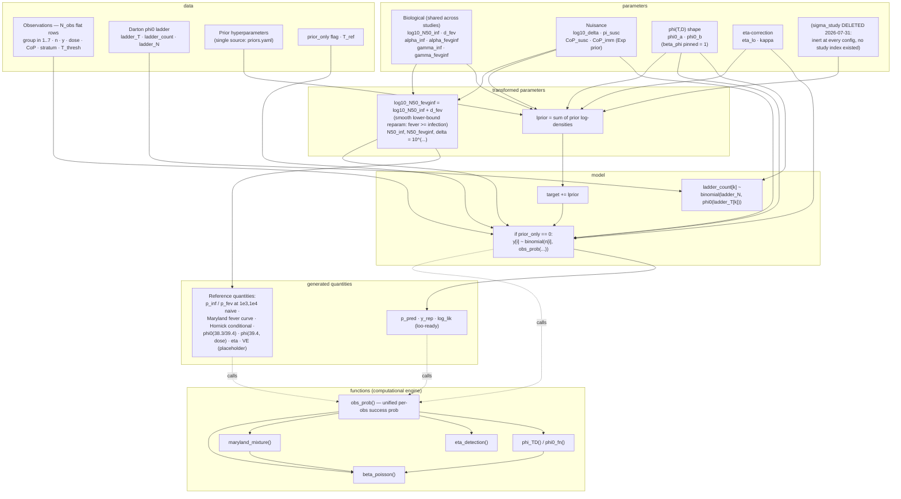
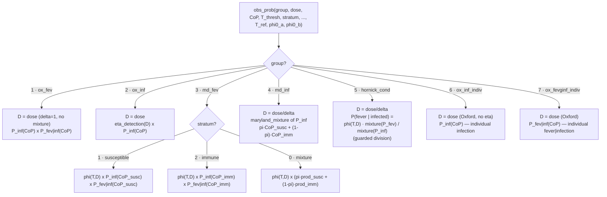

# Stan model structure — `typhoid_dose_response.stan`

Updated 2026-07-31 from [typhoid_dose_response.stan](calibration/typhoid_dose_response.stan). Per-configuration observation counts: [calibration/TIER_LADDER.md](calibration/TIER_LADDER.md)
(Tier 2 machinery; C3 dose-dependent phi + issue-#15 cascade). Two views:

1. **Program dataflow** — how the Stan blocks feed each other.
2. **`obs_prob` dispatch** — the scientific core: how each observation
   group maps to a binomial success probability.

Core kernels:

- **beta-Poisson**: `P = 1 - (1 + D_eff·(2^(1/alpha) - 1)/N50)^(-alpha / CoP^gamma)`,
  with `D_eff = D/delta` (caller applies `/delta` where needed).
- **eta detection**: `eta_lo + (1 - eta_lo)·exp(-kappa·D_eff/N50_inf)`.
- **Maryland mixture**: `pi_susc·P(CoP_susc) + (1 - pi_susc)·P(CoP_imm)`.
- **phi0(T)** (low-dose definition sensitivity): `inv_logit(phi0_a - phi0_b·(T - T_ref))`.
- **phi(T,D)** (dose-dependent): `phi0(T) + (1 - phi0(T))·P_fev_naive(D_eff)`
  (beta_phi dose-lift exponent PINNED to 1; P_fev_naive = CoP=1 cascade fever curve).

## 1. Program dataflow

## 2. `obs_prob` group dispatch (likelihood core)

Groups 6/7 (the issue-#15 cascade) carry the Darton placebo per-subject endpoints:
6 = infection (`bact_or_stool`, all 30), 7 = fever|infection (`fever_td`, the 26
infected). Together they factorize the per-subject cascade and separate `gamma_inf`
from `gamma_fevginf` (weakly — bounded by Darton's thin anti-Vi titre range).
