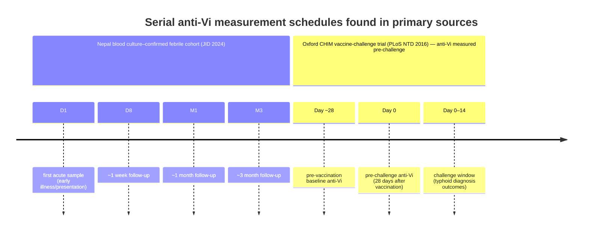
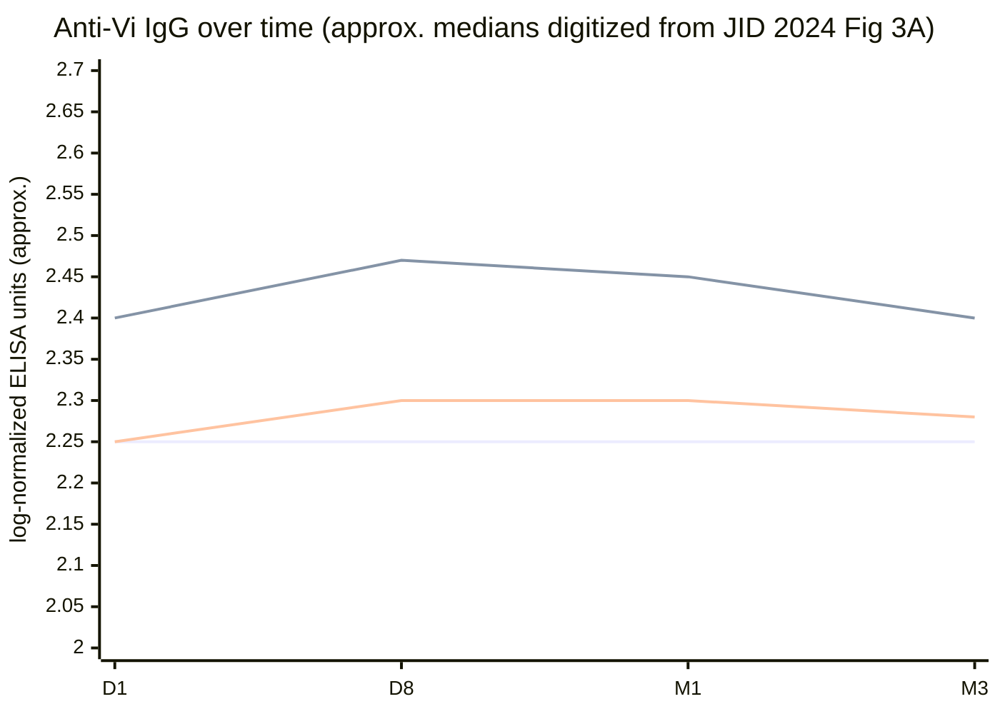

# Waning Dynamics of Anti‑Vi IgG After Natural *Salmonella Typhi* Infection: Longitudinal Evidence Review

## Executive summary

Longitudinal, serially sampled **anti‑Vi IgG** datasets following **bacteriologically confirmed enteric fever** are surprisingly scarce relative to the policy importance of Vi‑based vaccines and the frequent use of anti‑Vi serology in carrier investigations. The most directly informative contemporary dataset identified in this review is a **Nepal-based longitudinal cohort** with **blood culture–confirmed *S. Typhi* and *S. Paratyphi A*** infections and repeated sampling across **day 1, day 8, month 1, and month 3**, which includes **individual trajectories and smoothed curves** for anti‑Vi IgG. In that cohort, **anti‑Vi IgG changed only modestly** over time and was **similar by month 3** across groups—supporting the interpretation that **anti‑Vi IgG is a weak “infection clock” in endemic settings**, at least over the first ~3 months after presentation. citeturn36view0turn37view0turn37view2

Across the evidence base available here, three consistent themes emerge. First, **anti‑Vi responses after infection are often small, heterogeneous, and sometimes difficult to distinguish from baseline anti‑Vi already present in endemic communities**, limiting identifiability of a clean decay curve and making half‑life estimation unstable without longer follow-up. citeturn36view0turn37view0turn37view2 Second, historical and diagnostic serology literature using **Vi agglutination** describes **irregular and transitory** Vi antibody production during illness, implying that even “peak” timing can vary substantially and may be absent in some confirmed/probable cases (again undermining a robust waning model). citeturn32view0 Third, controlled human infection work highlights that even **low pre-existing anti‑Vi IgG** can be epidemiologically meaningful (associated with reduced hazard of diagnosis after challenge), but those studies are not designed to provide post‑infection long‑term waning kinetics. citeturn41view0

Evidence gaps are substantial: **few studies** report **anti‑Vi IgG (or total anti‑Vi) time series extending beyond 3 months after clinical presentation**, and I found **no high-quality infection-cohort paper** in this set that provides a **parametric decay model** (e.g., biexponential) with an estimated **anti‑Vi IgG half‑life** after natural infection (as distinct from vaccination).

## Methods

The approach prioritized **primary sources** and required that studies include: (a) **human infection** with *S. Typhi* (or bacteriologically confirmed enteric fever where anti‑Vi was reported), (b) **serial samples** (≥2 timepoints) from the same individuals or the same case series/cohort with repeated measures, and (c) measurement of **anti‑Vi IgG or total anti‑Vi** by any assay platform (ELISA/other immunoassay or agglutination), with extractable timing of samples.

Search and screening emphasized combinations of terms for Vi serology and kinetics (e.g., “anti‑Vi IgG”, “Vi antibody”, “typhoid”, “longitudinal”, “convalescent”, “blood culture”, “challenge model”). Because many vaccine immunogenicity papers include long follow-up but do **not** address post‑infection waning, vaccine-only studies were excluded unless they contained an **infection/challenge component** relevant to post‑exposure kinetics.

For quantitative extraction, when papers reported point estimates in figures without tables, I performed **conservative digitization by visual reading** from plotted axes and reported values as approximate ranges (clearly labeled as digitized/approximate). The only dataset in this review with readily interpretable “spaghetti” trajectories for anti‑Vi IgG is the Nepal cohort figure set. citeturn37view0turn37view2

## Included longitudinal studies

The table below focuses on studies that provided **serial anti‑Vi measurements** in the context of natural enteric fever or bacteriologically confirmed febrile illness (including a controlled challenge model).

| Study | Design & population | Infection confirmation | Anti‑Vi assay & units | Serial sampling schedule (reported) | Extractable anti‑Vi time series | Statistical analysis of change/waning | Notes on correlates |
|---|---|---|---|---|---|---|---|
| Mylona et al., *J Infect Dis* (JID) 2024 (Nepal) citeturn36view0turn37view0turn37view2 | Prospective longitudinal sampling of **febrile patients** in Nepal; comparisons across **blood culture confirmed *S. Typhi* (ST)**, **blood culture confirmed *S. Paratyphi A* (SPA)**, and **febrile culture‑negative (FCN)** controls; plus afebrile community controls for baseline reference. citeturn36view0turn37view0 | **Blood culture confirmation** for ST and SPA groups. citeturn36view0 | Indirect **ELISAs** for antigen-specific IgG, including **Vi IgG**; outcomes shown as **“ELISA units (log-normalized)”**. citeturn36view0turn37view0turn37view2 | **Day 1 (D1), Day 8 (D8), Month 1 (M1), Month 3 (M3)** over ~3 months. citeturn36view0turn37view2 | **Yes**: (a) individual trajectories with LOESS curves over time (including Vi panel), (b) boxplots with all points at D1/D8/M1/M3 for Vi. citeturn37view0turn37view2 | Friedman tests + pairwise Wilcoxon signed-rank tests (Bonferroni corrected) for timepoint comparisons in distributions; LOESS smoothing for trajectories; correlation analyses reported (Spearman ρ). citeturn37view2turn36view0 | Reports moderate correlations between anti‑Vi and some protein antigen IgG at D8 in SPA; does **not** report severity/antibiotic correlates for anti‑Vi kinetics. citeturn36view0 |
| “Agglutination tests in the diagnosis of enteric fever in the inoculated” (closed community, Indian frontier post; historical *J Hygiene* paper) citeturn32view0 | Observational, high-frequency serology in a **closed community** with many **inoculated soldiers**; >4000 sera total, includes **140 sera from 32 enteric fever cases** (serial specimens). citeturn32view0 | Enteric fever case grouping described; bacteriologic confirmation not fully extractable from the excerpted text in this workflow, but cases are discussed as “proven/enteric fever” within the diagnostic framework of the time. citeturn32view0 | **Vi agglutination** (Felix tube method) using standardized **Vi 1** antigen suspension and serial dilutions. Results reported as **agglutination titers** (e.g., >1:10). citeturn32view0 | Serial sera across illness; narrative references to dynamics “throughout the disease,” with emphasis on the first ~2 weeks and diagnostic thresholds (e.g., titers >1:10). citeturn32view0 | Limited: counts/percent meeting titer thresholds in time windows (e.g., first 2 weeks), rather than full individual quantitative curves. citeturn32view0 | Emphasizes heterogeneity: Vi agglutinins can be absent in some cases and appear “irregular and transitory.” citeturn32view0 | Focus is diagnostic interpretation in inoculated persons; not designed to model waning half-life; no treatment/severity correlates presented in the extracted sections. citeturn32view0 |
| Darton et al., *PLoS Negl Trop Dis* 2016 (Oxford, UK) — controlled human infection model (CHIM) vaccine‑challenge trial citeturn41view0 | Randomized controlled trial of vaccines with **experimental oral challenge** (Quailes strain); healthy adults in Oxford; follow-up during challenge period. citeturn41view0 | Typhoid diagnosis included fever and/or bacteremia; a large fraction of diagnoses were **blood culture confirmed** after challenge. citeturn41view0 | Anti‑Vi IgG measured in **ELISA units per mL (EU/mL)** with reported **lower limit of detection 7.4 EU/mL**. citeturn41view0 | Anti‑Vi IgG shown at **pre‑vaccination (Day −28)** and **pre‑challenge (Day 0)**; the paper’s key anti‑Vi analysis focuses on **baseline/persisting titers** as a predictor of susceptibility during the short challenge window. citeturn41view0 | Yes for baseline persistence over ~28 days and distribution by outcome; **not a post‑infection waning cohort** over months/years. citeturn41view0 | Proportional hazards models: **1 log increase in baseline anti‑Vi IgG associated with ~71% decrease in hazard of typhoid diagnosis** during challenge. citeturn41view0 | Highlights importance of low-level baseline anti‑Vi; does not provide longer-term post‑infection decay curves. citeturn41view0 |

## Findings on anti‑Vi kinetics after confirmed typhoid or bacteriologically confirmed febrile illness

**Most policy-relevant modern time series (Nepal; blood culture confirmed): minimal rise and limited measurable waning over 3 months.**  
In the Nepal longitudinal cohort (JID 2024), anti‑Vi IgG trajectories are plotted as **individual lines** with LOESS smooths across ~0–90 days, and distributions at **D1/D8/M1/M3** are shown with boxplots and all measured points. citeturn37view0turn37view2 The Vi-specific panel shows that **anti‑Vi IgG curves are comparatively flat** versus other antigens (e.g., O2/O9), with only **small between‑timepoint movement**. citeturn37view0turn37view2 The authors interpret this as evidence that **baseline anti‑Vi antibodies were already circulating in the community**, limiting Vi’s utility as an exposure marker—explicitly noting that **Vi may not be suitable as a marker of enteric fever exposure** in this setting. citeturn36view0

**Exact timepoints and schedules are explicit, but symptom-onset alignment is imperfect.**  
The same Nepal cohort clearly specifies longitudinal sampling at **D1, D8, M1, M3**. citeturn37view2 However, the study’s time axis reflects a follow-up schedule anchored to clinical sampling (enrollment/early illness), and symptom onset is not provided in the extracted text; therefore, reported curves should be interpreted as **“post‑presentation”** rather than “post‑symptom onset.” citeturn36view0turn37view0turn37view2

**Historical agglutination time series emphasize irregularity and short-lived detectability, complicating decay estimation.**  
The historical closed-community study using **Vi agglutination titers** argues that Vi agglutinins, when present, can be diagnostically informative but are often **“irregular and transitory,”** and that some proven enteric fever cases may not demonstrate Vi agglutinins at all. citeturn32view0 It also frames a practical threshold (e.g., titers >1:10) that might be useful for diagnosis given low background prevalence in controls, but does not present a clean, generalizable waning curve suitable for half‑life modeling. citeturn32view0

**Controlled human infection evidence shows baseline anti‑Vi is meaningful over short horizons, but does not supply post‑infection waning curves.**  
In the PLoS NTD 2016 CHIM trial, baseline anti‑Vi IgG varied among participants despite screening for typhoid/typhoid‑vaccine naïveté; baseline anti‑Vi IgG was the only baseline parameter reported as predictive of typhoid diagnosis during the 14‑day challenge window, with a strong hazard reduction per log‑unit increase in baseline anti‑Vi IgG. citeturn41view0 This supports the epidemiologic relevance of anti‑Vi IgG persistence, but the design was not oriented toward months‑to‑years post‑infection waning (and thus cannot resolve long-term antibody half-life after infection). citeturn41view0

## Visual synthesis of waning

### Sampling timeline comparison

(These timepoints are taken directly from the figures/text describing sampling schedules in the two primary studies. citeturn37view2turn41view0)

### Digitized pooled curves from blood culture–confirmed cohort

The following plot digitizes **approximate medians** (visually read from Figure 3A boxplots) for anti‑Vi IgG in the Nepal cohort; values are on the paper’s **“log-normalized ELISA units”** scale and should be treated as approximate (visual extraction uncertainty ~±0.03–0.06 on the plotted scale). citeturn37view2turn36view0

### What these curves imply about waning rates

Across D8→M3 (~80–90 days), the SPA and ST median curves show **very small declines** (on the order of a few hundredths of a unit on the plotted log-normalized scale), and FCN is essentially flat. citeturn37view2turn37view0 Because the signal is small and the measurement scale is **log-normalized ELISA units** (not directly IU/mL or µg/mL), a reliable **biologically interpretable half-life** cannot be robustly computed from these plotted summaries alone without additional assay calibration details and longer follow-up. citeturn36view0turn37view2

## Interpretation and gaps

The strongest direct evidence located here—blood culture–confirmed enteric fever with serial sampling—indicates that **anti‑Vi IgG shows limited dynamic range** in the first ~3 months after clinical presentation, with only small early changes and little separability at month 3. citeturn37view0turn37view2turn36view0 This makes “waning dynamics” hard to identify: if the response is not strongly boosted above baseline (or if baseline is already elevated due to prior exposure or cross-reactivity), then the decay curve is either **very slow** or **not identifiable** using standard seroincidence approaches that rely on a sharp peak and measurable exponential decline.

Evidence strength is moderate for the conclusion that **anti‑Vi IgG is a poor short-term infection clock** in endemic settings (supported by individual-level longitudinal trajectories and explicit timepoint comparisons). citeturn36view0turn37view0turn37view2 Evidence is weaker for any generalizable estimate of **anti‑Vi IgG half-life after natural infection**, because (a) follow-up horizons are short in the infection cohort identified here, (b) anti‑Vi is measured in a transformed unit scale without a decay model fit, and (c) historical agglutination literature emphasizes heterogeneity and transience rather than offering modern quantitative decay modeling. citeturn32view0turn36view0

Key gaps for future work include longer-term (≥12–24 month) follow-up after **blood culture/PCR-confirmed** typhoid with **standardized quantitative anti‑Vi IgG units** (e.g., calibrated to the WHO International Standard for anti‑Vi IgG), explicit anchoring to **symptom onset** and **treatment timing**, and analyses of correlates such as antibiotics, severity, relapse, and reinfection—none of which are sufficiently reported for anti‑Vi waning in the core longitudinal infection cohort identified here. citeturn36view0turn37view2turn41view0